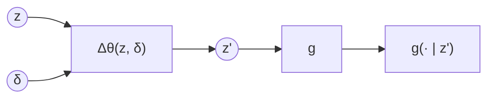
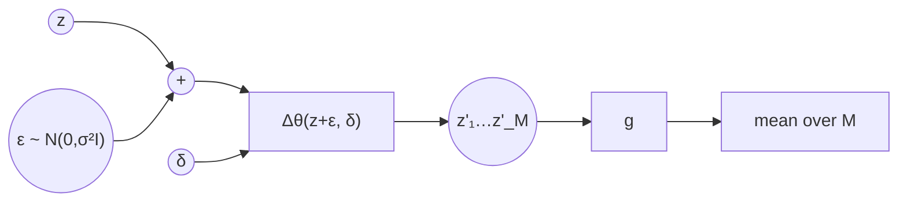
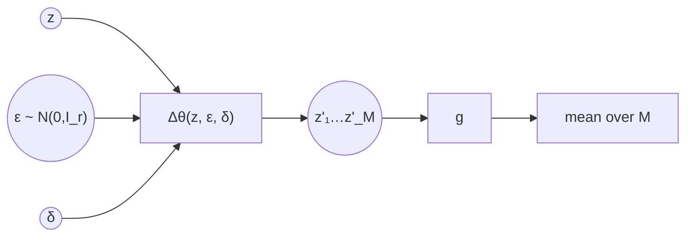
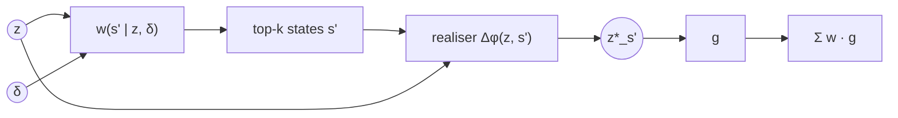
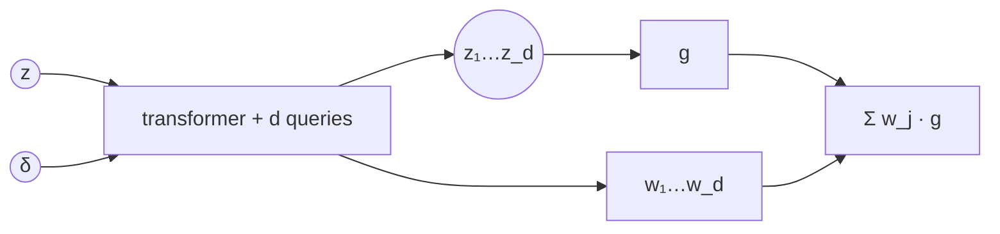

# Latent editor $h_Z$

$$h_Z(\cdot \mid z, \delta): \mathcal Z \to \Delta(\mathcal Z)$$

Freeze $f$, $g$ and $h_S$, then train $h_Z$ so that the two paths from $z$ to a distribution over
counterfactual states agree: $h_S\circ g = g\circ h_Z$.
Code: `src/latent_intervention.py`; select a plan with `latent_intervention.variant` in `src/config.yaml`.

**Notation.**

| symbol | meaning |
|---|---|
| $z \in \mathcal Z = \mathbb R^{128}$, $z'$ | factual latent, edited latent |
| $\delta$ | the do() action, e.g. do($X{=}3$), encoded as one token per column |
| $\mathbf s, \mathbf s' \in \mathcal S$ | factual / counterfactual structured state, $\lvert\mathcal S\rvert = 108$ |
| $\mathbb 1_{z}$ | point mass (Dirac) at $z$ |
| $\Delta_\theta$ | shift network, always residual and zero-initialised ($h_Z = \mathrm{id}$ at start) |
| $w$ | mixture weights |
| $M$, $k$, $d$, $r$ | Monte Carlo samples, top-$k$ states, particles, noise dimension |
| $\alpha$, $\beta$, $\lambda$ | L1, L2 and entropy weights |
| $\overline{\lvert v\rvert}$, $\overline{v^2}$ | mean absolute / mean squared entry of $v$ |

## Overview

| plan | `variant` / class | $h_Z(\cdot\mid z,\delta)$ | $g\circ h_Z$ computed by | weights from | label per component |
|---|---|---|---|---|---|
| 0 | `baseline` / `LatentIntervention` | $\mathbb 1_{z+\Delta_\theta(z,\delta)}$ | one $g$ pass | — | — |
| A | `pre_additive` / `LatentInterventionPreAdditive` | pushforward of $\varepsilon\sim\mathcal N(0,\sigma^2 I_{128})$ through $z+\Delta_\theta(z+\varepsilon,\delta)$ | Monte Carlo, $M$ passes | implicit | — |
| B | `noise_token` / `LatentInterventionNoiseToken` | pushforward of $\varepsilon\sim\mathcal N(0,I_r)$ through $z+\Delta_\theta(z,\varepsilon,\delta)$ | Monte Carlo, $M$ passes | implicit | — |
| C | `dist` / `LatentInterventionDist` | $\sum_{\mathbf s'} w_\theta(\mathbf s'\mid z,\delta)\,\mathbb 1_{z+\Delta_\phi(z,\mathbf s')}$ | exact, $k$ passes | learned $w_\theta$ (distilled from $h_S\circ g$) | state $\mathbf s'$ |
| D | `particles` / `LatentInterventionParticles` | $\sum_{j=1}^d w_j(z,\delta)\,\mathbb 1_{z+\Delta_{\theta,j}(z,\delta)}$ | exact, $d$ passes | learned $w_j$ (or uniform) | none |

The plans run from least to most structure in $h_Z$. A and B use continuous noise. C and D are
finite mixtures: C indexes its components by symbolic states, D by unlabelled slots. Taking the
weights of C from $h_S\circ g$ instead of learning them gives the most symbolic end
(C-sym, see Plan C).

## Shared objective

$$\mathcal L = \mathbb E_z\Big[D_{\mathrm{KL}}\big((h_S\circ g)(\cdot\mid z,\delta)\,\big\|\,(g\circ h_Z)(\cdot\mid z,\delta)\big)\Big] + \lambda\,\mathbb E_{z'\sim h_Z}\big[H\big(g(\cdot\mid z')\big)\big] + \alpha\,\overline{\lvert z'-z\rvert} + \beta\,\overline{(z'-z)^2}$$

* **Target.** $(h_S\circ g)(\cdot\mid z,\delta) = M_\delta^\top g(\cdot\mid z)$ is a dense
  $\lvert\mathcal S\rvert$-vector. $g$ and $h_S$ are frozen, so it is precomputed once.
* **Composition.** $(g\circ h_Z)(\mathbf s) = \int g(\mathbf s\mid z')\,h_Z(dz'\mid z,\delta)$: the
  sum over all possible $z'$ ("draw $z'$, then read $\mathbf s$ off it").
  * Plan 0 has a single point, so there is nothing to sum.
  * A and B estimate the integral with the Monte Carlo average $\tfrac1M\sum_m g(\cdot\mid z'_m)$.
  * C and D have finitely many points, so the sum is exact with weights $w$.
  * The average is taken over **probabilities** (log-sum-exp in code). Both alternatives are
    wrong: $g(\text{mean } z')$ is Plan 0's between-modes point, and a mean over log-probabilities
    is a mode-seeking geometric mean.
* **Forward KL** is mass-covering: $h_Z$ must not collapse onto one mode when the symbolic
  counterfactual is ambiguous.
* **Entropy term (B, D).** The KL alone cannot tell apart two solutions: parking $z'$ where $g$
  is ambiguous, or spreading $z'$ over points where $g$ is confident. Both give the same
  $g\circ h_Z$. The per-sample entropy prefers the second. It applies to A and C as well, but is
  not wired in there yet.
* **Penalties** (L1 sparsity, L2 proximity) are *means*, over the 128 latent dimensions and over
  samples, components or particles (`_penalties`). So $\alpha$ and $\beta$ are on a per-dimension
  scale, about $1/128$ of the equivalent weight on $\lVert\cdot\rVert_1$ or $\lVert\cdot\rVert_2^2$.
* Plan 0 skips the KL and trains per-column cross-entropy against the simulated $\mathbf s'$.

```python
@torch.no_grad()
def consistency_target(decoder, h_s, latents, intervention):  # (n, |S|) = M_delta^T g(. | z)
    m_t = h_s.transition_matrix(intervention).t().coalesce()
    return torch.sparse.mm(m_t, decoder.log_joint(latents).exp().t()).t()

def _forward_kl(pred_log, target):  # D_KL(target || pred), batch mean
    return F.kl_div(pred_log, target, reduction="batchmean")
```

---

## Plan 0 — Deterministic baseline



$$z' = z + \Delta_\theta(z, \delta)$$

* Residual transformer over $[z\text{-token}, \delta\text{-tokens}]$.
* The map is deterministic, but $g\circ h_Z$ is still a distribution. All of its randomness
  comes from $g$'s uncertainty at the single point $z'$.
* Per-column cross-entropy against the simulated $\mathbf s'$ is minimised when
  $g(\cdot\mid z') = p(\mathbf S'_j\mid z)$ for each column $j$. So Plan 0 learns the
  posterior-predictive **marginals** of the counterfactual.

**Benefits**
* Simplest option: one $g$ pass, and no $h_S$ needed during training.
* The natural shape of a *unit* counterfactual (see the open question below). It is trained on
  the true unit noise, so it can use information in $z$ beyond $g(z)$.

**Caveats**
* $(h_S\circ g)$ is multimodal in the ambiguous strata. A single $z'$ is then pulled to a point
  *between* the modes that decodes to neither. A post-additive Gaussian
  $z+\mu_\theta+\sigma_\theta\odot u$ fails the same way.
* With the factorised $g$ (`SemanticDecoder`), it is mean-field by construction: it cannot express
  correlations such as $D$ and $U$ moving together under uncertainty about $T$.
* With the autoregressive $g$, $z'$ must sit where $g$ is ambiguous in exactly the right
  proportions. That is off the text manifold, so decoding it gives a blend rather than a CV.

```python
def forward(self, z, values, mask):
    return z + self.delta(z, values, mask)
# loss: decoder.nll(z', s_prime) + alpha * L1 + beta * L2
```

---

## Plan A — Pre-additive noise (engression)



$$z' = z + \Delta_\theta(z+\varepsilon,\ \delta), \qquad \varepsilon\sim\mathcal N(0,\sigma^2 I_{128}), \qquad (g\circ h_Z) \approx \tfrac1M \textstyle\sum_m g(\cdot\mid z'_m)$$

* $h_Z$ is the pushforward of $\varepsilon$. A nonlinear $\Delta_\theta$ can fold the unimodal
  noise onto separated modes.
* $g\circ h_Z$ is computed with Monte Carlo ($M$ samples).
* In engression (Shen & Meinshausen), the noise is what produces the distribution. The model is
  trained with the energy score, so it is genuine distributional regression. The *pre-additive*
  placement is what buys extrapolation and robustness outside the training support.

**Benefits**
* Can represent arbitrary, including multimodal, distributions in $\mathcal Z$, with no
  bottleneck through $\mathcal S$.
* Well-known method with extrapolation guarantees for pre-additive noise.

**Caveats**
* Full-dimensional noise is added on top of the conditioning signal. $\Delta_\theta$ cannot tell
  the two apart, so part of $\varepsilon$'s effect is to blur $z$. Plan B separates them.
* The spread between samples comes only from $\Delta_\theta$'s nonlinearity. Locally it is
  $\approx J\varepsilon$, so folding the noise onto separate modes needs steep functions.
* The log-mean-exp estimate is biased for small $M$ (by Jensen, an upper bound on the KL).
  Gradient variance is highest in the ambiguous strata. An energy score on sampled
  $(z',\mathbf s')$ pairs would be closer to engression.
* No entropy term yet, so it can ignore $\varepsilon$.

```python
def forward(self, z, values, mask, generator=None):
    eps = self.noise_std * torch.randn(z.shape, generator=generator)
    return z + self.delta(z + eps, values, mask)
# composed_log_joint: _mc_mixture(M samples, decoder) -> logsumexp - log M
```

---

## Plan B — Outsourced noise token



$$z' = z + \Delta_\theta(z,\ \varepsilon,\ \delta), \qquad \varepsilon\sim\mathcal N(0, I_r), \qquad (g\circ h_Z) \approx \tfrac1M \textstyle\sum_m g(\cdot\mid z'_m)$$

* $\varepsilon$ enters as its **own token**: $[z\text{-token}, \varepsilon\text{-token}, \delta\text{-tokens}]$.
* Noise outsourcing: any conditional distribution can be written as $F(z, U)$. The counterfactual
  uncertainty here is low-dimensional ($T$, plus where $D$ and $U$ sit inside their bins), so
  $r\approx 2\text{–}8$.
* Trained on the Monte Carlo KL plus the entropy term.

**Benefits**
* $z$ reaches $\Delta_\theta$ intact, so noise and conditioning are separate.
* $r$ is an interpretable knob: the dimension of the counterfactual uncertainty.
* The entropy term forces the mixture to come from $\varepsilon$, not from $g$'s ambiguity.

**Caveats**
* Same Monte Carlo cost and bias as Plan A.
* The network can still learn to ignore $\varepsilon$. Watch the `spread` diagnostic (norm of
  the per-dimension std of $z'$ across $\varepsilon$). A value near 0 means $\varepsilon$ is
  ignored.
* $\lambda$ trades sharpness against the KL. It is untuned (default 0.1).

```python
def forward(self, z, values, mask, generator=None):
    eps = torch.randn(z.shape[0], self.noise_dim, generator=generator)
    return z + self.delta(z, values, mask, eps)  # _DeltaNet(noise_dim=r) adds the ε-token
# loss: KL(target || _mc_mixture) + lambda * E[H(g(z'))] + penalties; logs `spread`
```

---

## Plan C — Discrete mixture over counterfactual states



$$h_Z(\cdot\mid z,\delta) = \sum_{\mathbf s'\in\text{top-}k} w(\mathbf s'\mid z,\delta)\ \mathbb 1_{z^*_{\mathbf s'}}, \qquad z^*_{\mathbf s'} = z + \Delta_\phi(z,\mathbf s'), \qquad (g\circ h_Z) = \sum_{\mathbf s'} w(\mathbf s'\mid z,\delta)\, g(\cdot\mid z^*_{\mathbf s'})$$

* **Realiser.** $\Delta_\phi$ maps $z$ and a target state $\mathbf s'$ to $z^*_{\mathbf s'}$,
  which $g$ should read as $\mathbf s'$. It never sees $\delta$: it is a do()-agnostic
  "make $g$ read $\mathbf s'$" editor.
* **Weights.** $w$ is the **counterfactual** distribution over $\mathcal S$ given the text and
  the action, not a posterior over the factual state. $\delta$ enters $h_Z$ only here. There are
  three options:
  * *distilled* (implemented): $w_\theta$ is an autoregressive head, like $g$, trained on
    $D_{\mathrm{KL}}(h_S\circ g \,\|\, w_\theta)$;
  * *C-sym* (planned): $w = (h_S\circ g)(\cdot\mid z,\delta)$ exactly, so only $\Delta_\phi$ is
    trained;
  * *unit* (planned): $w_\theta$ trained by likelihood on the true $\mathbf s'$.
* **Mixture.** Keep the top-$k$ states, renormalise their weights, and realise each one.
  `sample()` draws $\mathbf s'$ from $w$ and realises it. `forward()` returns the argmax
  component.
* **Training.**
  * Pretraining: distil $w_\theta$, and fit $\Delta_\phi$ on the true $\mathbf s'$ with
    `decoder.nll` (mean per-column cross-entropy, i.e. the joint NLL divided by the number of
    columns for the factorised $g$) plus its *own* L1/L2 weights `realiser_l1` and `realiser_l2`,
    not $\alpha$ and $\beta$.
  * Joint phase: fine-tune both on the exact KL, with $\alpha$ and $\beta$ on the realised shifts.

**Benefits**
* Composition is exact: no inner expectation and no sampling variance.
* With a sharp realiser, $g(\cdot\mid z^*_{\mathbf s'})\approx\mathbb 1_{\mathbf s'}$, and the KL
  reduces to $D_{\mathrm{KL}}(h_S\circ g\,\|\,w)$. The bilevel problem splits into two
  supervised ones.
* Every component carries a symbolic label, so it is interpretable.
* C-sym makes the weights consistent by construction. Any remaining error comes from the realiser
  alone.

**Caveats**
* **Why learn $w_\theta$ at all?** $h_S\circ g$ is cheap and exact at $\lvert\mathcal S\rvert=108$.
  Distilling it can only lose accuracy. In the joint phase, $w_\theta$ can also drift to hide
  realiser errors. A learned $w_\theta$ earns its place only in the *unit* variant, for an
  intractable $\mathcal S$, or when the SCM is unavailable at deployment. Hence C-sym.
* **"Any state" is not what training does yet.** $\Delta_\phi$ is pretrained only on each unit's
  true $\mathbf s'$. Other top-$k$ states are seen only through the joint KL. Fix: pretrain on
  states sampled from $h_S\circ g$ or uniformly from $\mathcal S$.
* **Sharpness is not identified.** The joint KL can pull $z^*_{\mathbf s'}$ towards ambiguous
  positions. Add the entropy term.
* **Truncation is lossy where it matters.** The support of $h_S\circ g$ is the union of the rows
  of $M_\delta$ over $g$'s support. It is small only where $g$ is near one-hot, i.e. not in the
  ambiguous strata. Measure it before fixing $k$.
* **Bottleneck.** $h_Z$ can only produce counterfactuals expressible in $\mathcal S$. Plans A, B
  and D give up less, but their extra freedom is unsupervised.
* Cost: $k$ passes of $g$, comparable to Monte Carlo with $M=k$. The gain is in the pretraining.
* Structurally close to GPT's $G\to K\to Q$, with $w_\theta$ in $K_S$'s role. $Z'$ never enters
  a loss.

```python
def composed_log_joint(self, z, values, mask, decoder):
    idx, logw = self.w_theta.top_k(z, values, mask, self.top_k)        # (batch, k)
    zs = [self.realise(z, unflatten_state_index(idx[:, j], self.columns)) for j in range(idx.shape[1])]
    comps = [logw[:, j:j+1] + decoder.log_joint(z_j) for j, z_j in enumerate(zs)]
    return torch.logsumexp(torch.stack(comps), dim=0), torch.stack(zs) - z
# pretrain: w_theta <- KL(target || w_theta);  realiser <- decoder.nll(z*_s', s') + realiser_l1/l2 (true s')
# joint:    KL(target || composed) + alpha/beta on the realised shifts
```

---

## Plan D — Deterministic particle set



$$h_Z(\cdot\mid z,\delta) = \sum_{j=1}^d w_j(z,\delta)\ \mathbb 1_{z_j}, \qquad z_j = z + \Delta_{\theta,j}(z,\delta), \qquad (g\circ h_Z) = \sum_j w_j\, g(\cdot\mid z_j)$$

* $\Delta_\theta(z,\delta)\in\mathbb R^{d\times128}$ produces $d$ points deterministically. $g$
  translates each one to $\mathcal S$, and the weighted sum gives a distribution over states.
* DETR-style: $d$ learned query tokens attend to $[z\text{-token}, \delta\text{-tokens}]$. Each
  query's output is one shift and, optionally, one weight logit.
* The output layers are zero-initialised, so all particles start at $z$ with uniform weights. The
  random query embeddings break the symmetry.
* Trained on the exact KL plus the weighted per-particle entropy $\sum_j w_j H(g(\cdot\mid z_j))$.
  The shift penalties apply to every particle, unweighted.
* Relation to the other plans:
  * C without labels;
  * B with the noise replaced by $d$ learned codes;
  * close to multiple-hypothesis prediction (Rupprecht et al. 2017), but with a KL loss in
    $\mathcal S$ instead of winner-take-all.

**Benefits**
* Exact and deterministic: no sampling, no $h_S$ or labels at inference, no realiser supervision.
* No bottleneck through $\mathcal S$. Labels can still be read off afterwards via
  $\arg\max g(z_j)$.
* Clean ablation against C-sym. Weights and locations go from fully symbolic to fully learned.

**Caveats**
* **Uniform weights** (`uniform_weights: true`) limit resolution to steps of $1/d$. The model then
  makes particles ambiguous to fill in fractions. Learned weights are the default.
* **Collapse and dead particles.** Watch `eff_particles` ($1/\sum_j w_j^2$) and
  `distinct_states` (number of distinct $\arg\max g$ over the particles).
* $d$ should be at least the support of $h_S\circ g$ (same measurement as C's $k$). Start with
  $d = 16$.
* The particles are constrained only in directions $g$ can read, so off-manifold drift is the main
  risk (see below).

```python
def particles(self, z, values, mask):
    tokens = torch.cat([self.vec_proj(z)[:, None], self.cond(values, mask), self.queries.expand(len(z), -1, -1)], 1)
    h = self.layer(tokens)[:, -self.n_particles:]                      # (batch, d, d_model)
    log_w = F.log_softmax(self.weight_head(h).squeeze(-1), -1)          # or -log d if uniform
    return self.out(h).transpose(0, 1), log_w                          # (d, batch, 128), (batch, d)
# composed = logsumexp_j(log_w_j + g.log_joint(z + shift_j)); loss = KL + lambda * sum_j w_j H_j + penalties
```

---

## Evaluation

`src/pipeline.py evaluate` currently scores **one** $z'$ per text by argmax accuracy against
$\mathbf s'$ (for A/B, one draw seeded with the global seed; for C/D, the top component). That is fair to Plan 0 but undersells A–D. Report per plan:

* the KL of $g\circ h_Z$ against $h_S\circ g$ (exact for C/D, $M$ samples for A/B);
* the log-likelihood of the true $\mathbf s'$ under $g\circ h_Z$ (the unit-level view);
* both split by strata of $g$'s confidence, since that is where the plans differ;
* the mean per-sample entropy, plus `spread` (A/B) or `eff_particles` / `distinct_states` (D).

## Shared risk: adversarial edits against a frozen probe

Every plan optimises latents to convince a frozen classifier, which is the textbook construction
of an adversarial example. $\Delta$ can find off-manifold directions that make $g$ read
$\mathbf s'$, while $z'$ is nowhere near a real counterfactual latent. The result would be
excellent RQ1a numbers with worthless RQ1b recovery. Anything downstream of $z'$ (decoding it,
or a fairness penalty on a predictor $p(Z')$) would then be meaningless.

Why the risk is high here:

* In 128 dimensions with an MLP probe, very small steps can flip $g$.
* L1/L2 proximity *favours* the smallest convincing edit, which is the textbook adversarial
  perturbation. These penalties limit step size, not plausibility.
* LangVAE posterior means have near-constant (partly collapsed) dimensions. $g$'s response to
  them is untested, so they are a free channel for fooling it.

**Check first** (on the encoded held-out counterfactual pairs):

1. Is $\lVert z'-f(x')\rVert < \lVert z-f(x')\rVert$?
2. Independent probe: does a second $g$ (different seed or architecture) agree with $g$ on $z'$?
   Disagreement on $z'$, but not on real latents, means the edits are adversarial.
3. Round trip $g(f(\mathrm{dec}(z')))$. Only meaningful after fine-tuning LangVAE.

**Defences if a check fails** (not implemented; add only if needed):

* **Whitened L2 in place of L2**, keeping L1: $\beta\,(z'-z)^\top\hat\Sigma^{-1}(z'-z)$.
  * $\hat\Sigma$ is the shrinkage covariance of the training latents (use $\hat\Sigma+\epsilon I$
    or Ledoit–Wolf, since the collapsed dimensions make it nearly singular).
  * It is still a deviation penalty, but moves along directions where real latents do not vary
    become expensive.
  * Planned as `proximity: euclidean | mahalanobis`, applied in `_penalties` for all plans. $\beta$
    must be retuned.
  * Do *not* use an absolute term $\lVert z'-\mu\rVert_{\hat\Sigma^{-1}}$: it pulls every $z'$
    towards the average CV. Use $\mathcal N(0,I)$ neither, because posterior means are not
    distributed that way. If more is needed, add a one-sided typicality hinge
    $\max(0, \lVert z'-\mu\rVert^2_{\hat\Sigma^{-1}} - \lVert z-\mu\rVert^2_{\hat\Sigma^{-1}})$.
* Keep dropout active in $g$ at edit time, or use an ensemble of $g$.
* A learned density model on the latents, if the Gaussian picture is too coarse.
* Identity check: $\mathbf s'=\mathbf s \Rightarrow z'\approx z$. It is cheap and catches
  adversarial drift immediately.

## Open question: unit or distributional counterfactual?

To be argued openly in the paper. The plans commit to different readings: Plan 0 (and C-unit)
target the unit counterfactual, while A, B, D and C-distilled/C-sym target the distributional
one.

**For the unit counterfactual.** A text is one unit, and its rung-3 counterfactual is deterministic
once the exogenous noise is known. The spread in $h_S\circ g$ has two sources, and neither belongs
to the unit:

* the coarseness of $\mathcal S$: $T$ is hidden, and where $D$ and $U$ sit inside their bins is
  unknown;
* information discarded by $g$: the proxies $P, L, H, A$ and the wording.

If $z$ carries that evidence, $p(\mathbf S'\mid z)$ is sharper than $h_S\circ g$, and the
consistency KL makes $h_Z$ less informative than the text allows.

**For the distributional counterfactual.** The symbolic counterfactual is the only one we can
*check*. $h_S$ is the ground truth we own, and $g$ is the only lens on $z$. Anything sharper is an
unverifiable claim about what the encoder "knows", and it depends on how much noise the LLM happened
to leak into the text. Under uncertainty about the factual state, an honest manipulator returns a distribution of plausible
counterfactual latents, inheriting the SCM's uncertainty.

**What the experiment can say.**

* `talent_posterior_accuracy()` gives the Bayes-optimal recovery of $T$.
* Compare $\mathrm{KL}(p(\mathbf S'\mid\text{true noise})\,\|\,g\circ h_Z)$ across the plans,
  split by strata of $g$'s confidence.

Where $g$ is confident, the two targets coincide. In the ambiguous strata, the difference between
them measures how much information beyond $\mathcal S$ the latent carries.
