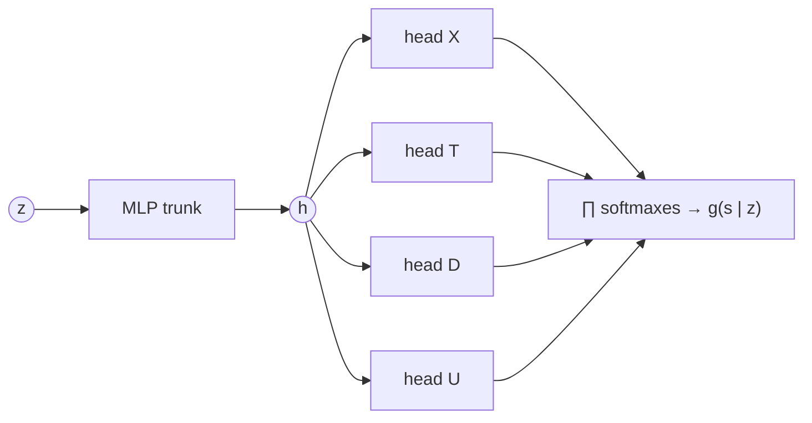
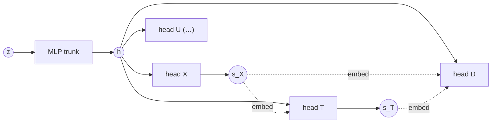
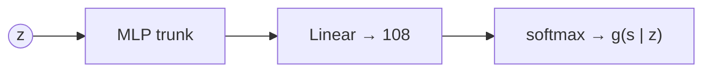

# Semantic decoder $g$

$$g(\mathbf s \mid z): \mathcal Z \to \Delta(\mathcal S)$$

$g$ maps a frozen latent to a **distribution** over structured states, not a point estimate.
The consistency constraint $h_S\circ g = g\circ h_Z$ compares two such distributions.
Code: `src/semantic_decoder.py`; select a variant with `semantic_decoder.variant` in `src/config.yaml`.

**Notation.**

| symbol | meaning |
|---|---|
| $z \in \mathcal Z = \mathbb R^{128}$ | latent (LangVAE posterior mean) |
| $\mathbf s = (s_X, s_T, s_D, s_U) \in \mathcal S$ | structured state in schema order, $\lvert\mathcal S\rvert = 4\cdot3\cdot3\cdot3 = 108$ |
| $s_{<i}$ | the columns before $i$ in schema order (= topological order of the SCM) |
| $\Delta(\mathcal S)$ | probability simplex: $q\in\mathbb R^{108}_{\ge0}$, $\sum_{\mathbf s} q_{\mathbf s}=1$ |
| $\mathbf s$ columns | $X$ region, $T$ talent (hidden: decoded, never verbalised), $D$ degree, $U$ university tier |

## Overview

| variant | class | $g(\mathbf s\mid z)$ | output units | joint | status |
|---|---|---|---|---|---|
| `independent` | `SemanticDecoder` | $\prod_i g(s_i\mid z)$ | $\sum_i \lvert\mathcal S_i\rvert = 13$ | product of marginals | default |
| `autoregressive` | `SemanticAutoRegDecoder` | $\prod_i g(s_i\mid s_{<i}, z)$ | 13 (heads widen with the prefix) | exact | implemented |
| flat softmax | — | $\mathrm{softmax}(W h)_{\mathbf s}$ | $\lvert\mathcal S\rvert = 108$ | exact | rejected |

Both variants share the MLP trunk and training loop and expose the same interface: `forward`
(per-column logits), `nll`, `predict`, `log_joint` (dense $(batch, 108)$ vector in
column-major order, the view that $h_S$ and $h_Z$ consume), `save`/`load`.

## Training

$$\mathcal L_g = \mathbb E_{(z,\mathbf s)}\big[-\log g(\mathbf s\mid z)\big]$$

* Cross-entropy is a strictly proper scoring rule, so its population minimiser is the true
  $p(\mathbf s\mid z)$. No noise model is needed.
* `train_semantic_decoder(decoder, latents, targets)` works for both variants via `decoder.nll`.
  `targets_from_dataframe` turns a sim CSV into per-column targets.
* **Calibration matters more than accuracy.** The consistency target $h_S\circ g$ uses $g$'s
  probabilities directly, so a miscalibrated $g$ corrupts every $h_Z$ plan. Measure it (per-column
  ECE, reliability curves) and apply temperature scaling on a held-out split if needed.
* **Loss scales differ.**
  * `independent`: `nll` is the *mean* cross-entropy per column (the joint NLL divided by 4).
  * `autoregressive`: `nll` is the *full* joint NLL.

  The effective learning rate differs between the variants, and so does any downstream loss that
  calls `decoder.nll` (the Plan 0 consistency term, Plan C's realiser pretraining) relative to its
  penalties.
* **$T$ has a ceiling.** $T$ is never verbalised and reaches the text only through the proxies
  $P, L, H, A$. The $T$ head cannot beat the Bayes-optimal recovery
  `exp.sim.talent_sfm.talent_posterior_accuracy()`. Compare against it, not against 100 %.

---

## Independent heads (`independent`)



$$g(\mathbf s\mid z) = \prod_{i\in\{X,T,D,U\}} \mathrm{softmax}\big(W_i\, h(z)\big)_{s_i}$$

* Shared MLP trunk $h$ (`n_hidden` × Linear–GELU–Dropout), then one linear categorical head per
  column.
* The columns are conditionally independent given $z$.
* `log_joint` is the outer sum of the per-column log-softmaxes.

**Benefits**
* Smallest model: 13 output units, one pass, trivial to train on few examples.
* **Probably sufficient for the talent SFM.** $X$, $D$ and $U$ are verbalised, so given $z$ they
  are near-certain; most of the uncertainty sits in $T$. When only one column is uncertain, the
  product of marginals *is* the joint.

**Caveats**
* The independence assumption is false in general. It bites only if two or more columns are
  uncertain together, e.g. an ambiguous degree statement combined with an uncertain $T$.
  Switch to `autoregressive` if per-column accuracy is fine but the joint is not.
* With several uncertain columns, it cannot express their correlations, and the error carries over
  to $h_S\circ g$.

```python
class SemanticDecoder(nn.Module):
    def forward(self, z):                   # {column: (batch, n_categories) logits}
        h = self.trunk(z)
        return {name: head(h) for name, head in self.heads.items()}

    def log_joint(self, z):                 # (batch, |S|), column-major
        logps = [F.log_softmax(l, dim=-1) for l in self.forward(z).values()]
        acc = logps[0]
        for lp in logps[1:]:
            acc = (acc[..., None] + lp[:, None, :]).reshape(acc.shape[0], -1)
        return acc
```

---

## Autoregressive heads (`autoregressive`)



$$g(\mathbf s\mid z) = \prod_{i} \mathrm{softmax}\big(W_i\,[\,h(z),\ e(s_{<i})\,]\big)_{s_i}$$

* Same trunk. Head $i$ additionally receives the concatenated embeddings $e(s_{<i})$ of all
  earlier columns (`embed_dim` each), so its input width is `hidden_dim + i·embed_dim`.
* Each head conditions on the full prefix, not only on the SCM parents $\mathbf{pa}(i)$. That is
  harmless and more flexible.
* **Training:** teacher forcing on the true prefix (`log_prob`).
* **`predict`:** greedy sequential argmax.
* **`log_joint`:** enumerates all prefixes, i.e. one head evaluation per partial state, which is
  cheap at $\lvert\mathcal S\rvert = 108$.

**Benefits**
* Exact joint with no independence assumption, still with only 13 output units.
* The schema order is topological ($X \to T \to D, U$), so the factorisation follows the causal
  story.

**Caveats**
* `predict` is greedy, so it returns a mode of the prefix chain, not necessarily the joint argmax.
  Use `log_joint().argmax()` when the exact mode matters.
* `nll` is on the joint scale (see Training).
* More parameters and slower `log_joint`. Only worth it if the independent variant's joint is
  measurably wrong.

```python
def log_prob(self, z, s):                   # teacher-forced log g(s | z), (batch,)
    h, prefix, total = self.trunk(z), [], 0.0
    for c in self.columns:
        logits = self.heads[c.name](torch.cat([h, *prefix], dim=-1))
        total = total + F.log_softmax(logits, dim=-1).gather(-1, s[c.name][:, None]).squeeze(-1)
        prefix.append(self.embed[c.name](s[c.name]))
    return total
```

---

## Flat joint softmax (rejected)



$$g(\mathbf s\mid z) = \mathrm{softmax}\big(W\, h(z)\big)_{\mathbf s}$$

* One categorical over all 108 joint states.

**Benefits**
* Trivially exact joint, and it composes directly with the transition matrix $M_\delta$.
* At $\lvert\mathcal S\rvert = 108$ it is affordable (a $256\times108$ final layer).

**Caveats**
* No sharing of statistical strength across columns. Each joint state is its own class, so rare
  combinations get few examples. The test batch has $n = 10$ (`exp/sim/config.yaml`).
* $h_S\circ g$ moves mass onto states that were rare or absent factually. Exactly those states are
  poorly learned by a flat head.
* It does not scale: the archived CV-screening schema had $\lvert\mathcal S\rvert = 3456$.
* Nothing is gained downstream: both implemented variants already produce the dense vector via
  `log_joint`. The flat vector is a *view*, not a parameterisation.
