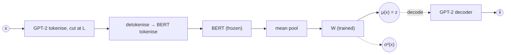
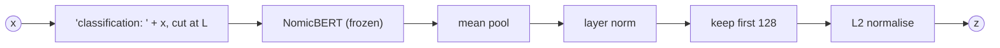
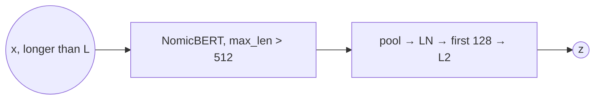

# Text encoder $f$

$$f: \mathcal X \to \mathcal Z = \mathbb R^{128}$$

$f$ maps a CV text to a fixed latent. It is **frozen** and deterministic, so $g$ and $h_Z$ are
trained on a fixed set of latents and $h_Z(f(x))$ is well defined.
Code: `src/encoder.py`, called by `src/pair_encoding.py` (`pipeline encode`); select a variant
with `encoder.variant` in `src/config.yaml`.

**Notation.**

| symbol | meaning |
|---|---|
| $x \in \mathcal X$ | CV text (`cv_factual.csv`, `cv_counterfactual.csv`) |
| $z = f(x) \in \mathcal Z = \mathbb R^{128}$ | latent; $x'$ and $z' = f(x')$ for counterfactual texts |
| $L = 512$ | input budget in tokens (`encoder.max_len`) |
| $B = 500$ | GPT-2 token budget enforced at generation (`text_length.max_tokens`, `exp/sim/config.yaml`) |
| $\mathrm{BERT}(\cdot)$, $\mathrm{NomicBERT}(\cdot)$ | frozen transformer; token embeddings in $\mathbb R^{768}$ |
| $\bar e(x) \in \mathbb R^{768}$ | masked mean pool of the token embeddings |
| $W \in \mathbb R^{256\times768}$ | LangVAE's trained posterior projection (no bias) |
| $\mu(x), \sigma^2(x)$ | LangVAE posterior mean and variance, each in $\mathbb R^{128}$ |
| $[v]_{1:128}$ | first 128 coordinates (Matryoshka truncation) |
| $\mathrm{LN}$ | layer norm without affine parameters |

## Overview

| variant | `variant` / class | $f(x)$ | trained on | context | decoder $\mathcal Z \to \mathcal X$ | geometry | status |
|---|---|---|---|---|---|---|---|
| `langvae` | `TextEncoder` | $\mu(x)$ | EntailmentBank sentences | $L$ | yes (GPT-2) | $\mathbb R^{128}$, VAE prior | default |
| `langvae` + `local_checkpoint` | `TextEncoder` | $\mu(x)$, refit $W$ | generated CVs | $L$ | yes | as above | implemented (`src/finetune_vae.py`) |
| `nomic` | `NomicTextEncoder` | $[\mathrm{LN}(\bar e)]_{1:128} / \lVert\cdot\rVert_2$ | general contrastive pairs | $L$ (model: 8192) | no | unit sphere $S^{127}$ | implemented |
| `nomic`, long input | `NomicTextEncoder` | as above | as above | $> L$ | no | $S^{127}$ | planned |

Both variants are a frozen transformer, mean pooling, and a map to 128 dimensions. They differ in
what that last map was trained for: reconstruction (`langvae`) or similarity (`nomic`).

## Shared interface and artifact

$$\mathcal D_Z = \{(\mathrm{id}, f(x))\} \cup \{(\mathrm{id}, f(x'))\ :\ \mathrm{id} \in \text{test}\}$$

* **Interface.** `encode(texts, deterministic=True, batch_size)` returns an `(n, 128)` tensor.
  `latent_dim` is 128. `make_encoder(config, variant=None)` builds the configured class.
* **Pairs.** `encode_pairs` encodes all factual texts and the non-identity test counterfactuals in
  one pass. Identity pairs ($x' = x$) copy $z$ exactly. It checks that the latents are 128-D and
  finite.
* **Provenance.** `paths.latents` is the same for both variants, so a new encode overwrites the old
  one. The sibling `*.info.json` records the variant, model, revisions, prefix, normalisation and
  input hashes. **Changing the encoder means re-encoding and retraining $g$ and $h_Z$.** The two
  latent spaces are not interchangeable.
* **Length budget.** Any token beyond $L$ is cut silently. Generation therefore rejects CVs over
  $B$ GPT-2 tokens (`exp/sim/text_length.py`). On the current `cv_factual.csv`: at most 499 GPT-2
  tokens, 501 BERT-cased tokens, and 498 Nomic tokens including the prefix. Nothing is truncated
  today, but the margin is small.
* **128 dimensions are fixed.** The dimension of $\mathcal Z$ is shared by $g$, $h_Z$ and the
  sparsity and proximity penalties on $z' - z$, so both variants must output 128-D vectors
  natively, without an added projection.

---

## LangVAE (`langvae`)



$$\bar e(x) = \mathrm{meanpool}\,\mathrm{BERT}(x_{1:L}),\qquad
\big(\mu(x),\ \log\sigma^2(x)\big) = W\,\bar e(x),\qquad f(x) = \mu(x)$$

* Checkpoint `neuro-symbolic-ai/eb-langvae-bert-base-cased-gpt2-l128` (pinned revision): a
  `bert-base-cased` encoder and a GPT-2 decoder, trained as a VAE on short EntailmentBank
  explanations.
* **Only $W$ is trained on the encoder side.** LangVAE detaches the pooled BERT output, so $f$ is a
  linear projection of a frozen, general-purpose sentence embedding.
* Input is tokenised with the *decoder's* GPT-2 tokenizer (cut at $L$). LangVAE turns the tokens
  back into text and tokenises again for BERT, which also cuts at 512.
* `deterministic=True` returns $\mu(x)$. `deterministic=False` samples
  $z \sim \mathcal N(\mu, \sigma^2)$ (not used by the pipeline).
* `decode(z)` generates text with the GPT-2 decoder, as a round-trip sanity check.
* **Fine-tuned option.** `src/finetune_vae.py` continues VAE training on the generated CVs
  (cyclical-β schedule, `finetune_vae` section). Set `encoder.local_checkpoint` to the resulting
  folder. Because BERT stays frozen, this refits $W$ and the decoder, not BERT's features.

**Benefits**
* A real generative latent space: a decoder $\mathcal Z \to \mathcal X$ and a Gaussian prior. This
  keeps open the step from $z'$ to counterfactual *text*, which the extended abstract frames as the
  method.
* Unconstrained $\mathbb R^{128}$, so the residual update $z' = z + \Delta$ stays in the model's
  domain.
* The same codebase can fine-tune it on the target domain.

**Caveats**
* **Out of domain.** It was trained on single short sentences, while the CVs run up to about
  500 tokens. BERT still reads the full CV, but $W$ was never fitted to pooled multi-paragraph
  embeddings. Decoding long CVs has poor fidelity until the model is fine-tuned.
* The context is capped at 512 by BERT's position embeddings. Fine-tuning cannot raise it.
* Mean-pooling a whole CV may dilute sparse facts, such as a single country mention.
* The tokenise, detokenise, retokenise round trip means lossy text normalisation could in principle
  change what BERT sees.

```python
class TextEncoder:
    @torch.no_grad()
    def encode(self, texts, deterministic=True, batch_size=32):
        dataset = TokenizedDataSet(texts, self.model.decoder.tokenizer, self.max_len)
        for start in range(0, len(texts), batch_size):
            x = dataset[start : start + batch_size]["data"].to(self.device)
            z = self.model.encoder(x).embedding if deterministic else self.model.encode_z(x)[0]
            ...
# LangVAE's encoder: pooled = mean_pool(BERT(retokenise(x))).detach(); mu, logvar = W(pooled)
```

---

## Nomic Embed v1.5 (`nomic`)



$$f(x) = \frac{[\mathrm{LN}(\bar e(x))]_{1:128}}{\lVert[\mathrm{LN}(\bar e(x))]_{1:128}\rVert_2},\qquad
\bar e(x) = \mathrm{meanpool}\,\mathrm{NomicBERT}(\texttt{"classification: "} \oplus x)_{1:L}$$

* `nomic-ai/nomic-embed-text-v1.5` (137M parameters). The model and its remote code are pinned
  separately (`nomic_model_revision`, `nomic_code_revision`), and loading it needs
  `trust_remote_code`.
* The pooling, layer norm, truncation and L2 steps follow Nomic's documented recipe for Matryoshka
  output. The task prefix comes from `nomic_task` (default `classification`).
* Deterministic only: `deterministic=False` raises `ValueError`. No decoder.

**Benefits**
* **The 128-D output was trained, not cut down afterwards.** Matryoshka training covers
  768/512/256/128/64 dimensions, so it fits $\mathcal Z = \mathbb R^{128}$ with no extra
  projection that could confound results. Most embedders only reach 128-D through PCA or ad hoc
  truncation.
* **Long context.** The architecture uses rotary positions and supports up to 8192 tokens, which
  removes BERT's hard 512 limit once the budget is raised (see the planned long-input variant).
* **Open and reproducible.** Weights, training code and data are public (Apache-2.0), and the exact
  revisions are pinned.
* Small enough to run on CPU (`encoder.device: cpu`).

**Caveats**
* **No generative path.** There is no $\mathcal Z \to \mathcal X$ decoder, so it supports checking
  consistency in $\mathcal Z$ but not generating counterfactual text. `decode` does not exist.
* **The latents lie on the unit sphere $S^{127}$.** $z + \Delta$ leaves the sphere, and the
  sparsity and proximity weights (tuned for the LangVAE scale) need retuning.
* **Trained for similarity.** Contrastive training may suppress attributes that don't affect
  topical similarity, such as the country region $X$. Check the per-column accuracy of $g$ before
  reading anything into results for $h_Z$.
* The prefix costs a few tokens of $L$. It is already included in the 498-token maximum above.

```python
class NomicTextEncoder:
    latent_dim = 128

    @torch.no_grad()
    def encode(self, texts, deterministic=True, batch_size=32):
        batch = [self.task_prefix + t for t in texts[start : start + batch_size]]
        inputs = self.tokenizer(batch, padding=True,
                                truncation=True, max_length=self.max_len, return_tensors="pt")
        tokens = self.model(**inputs)[0]
        mask = inputs["attention_mask"].unsqueeze(-1).to(tokens.dtype)
        e = F.layer_norm((tokens * mask).sum(1) / mask.sum(1).clamp(min=1e-9), (tokens.shape[-1],))
        return F.normalize(e[:, : self.latent_dim], p=2, dim=1)
```

---

## Nomic, long input (planned)



$$f(x) \text{ as for } \texttt{nomic},\ \text{with } L > 512$$

* Raise `encoder.max_len` and `text_length.max_tokens` together, and count the budget with the
  Nomic tokenizer instead of GPT-2.

**Benefits**
* Removes the length limit on generated CVs, including the retries and API credits spent on
  over-budget responses.

**Caveats**
* Nomic's documentation says contexts beyond its 2048-token training length need rotary scaling
  (`rotary_scaling_factor`). Check the pinned remote code before relying on it.
* Longer CVs make mean pooling dilute sparse facts even more.
* It breaks comparability with the `langvae` variant, which stays at 512.

---

## Alternatives considered

| model | trained 128-D | context | why not now |
|---|---|---|---|
| Qwen3-Embedding-0.6B | yes (Matryoshka, down to 32) | 32k | 4× larger; the strongest candidate for testing whether results depend on the encoder |
| EmbeddingGemma-300m | yes | 2k | Gemma licence |
| jina-embeddings-v3 | yes | 8k | non-commercial licence, 570M |
| mxbai-embed-large, bge, e5 | no | 512 | same limit as LangVAE, no trained 128-D output |
| OpenAI `text-embedding-3` | via `dimensions` | 8k | closed and can change silently; not reproducible; billed |

## Open questions

* Does `g` recover $X$, $D$ and $U$ equally well from both spaces? Compare per-column accuracy on
  the same split before comparing $h_Z$ variants.
* Is the text decoder needed for the paper's claims? If so, `nomic` stays a comparison only, and
  the main line is fine-tuned `langvae`.
