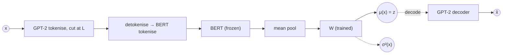
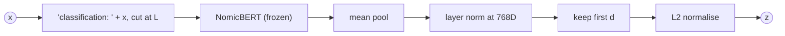
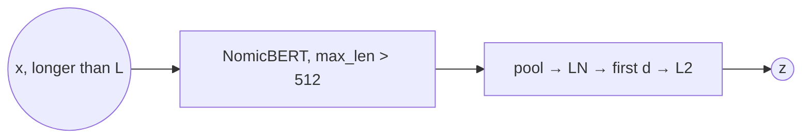

# Text encoder $f$

$$f: \mathcal X \to \mathcal Z = \mathbb R^d$$

LangVAE uses $d=128$. Nomic supports $d\in\{64,128,256,512,768\}$, configured by
`encoder.nomic_latent_dim` or `--nomic-dim`, defaulting to 128. Nomic artifacts are named
`nomic_<d>`, including `nomic_128`; this changes the artifact tag, not the `nomic` variant.
Qwen3-Embedding-0.6B supports the configured grid
$d\in\{32,64,128,256,512,768,1024\}$ through `encoder.qwen3_latent_dim` or `--qwen3-dim`.
Its directories are `qwen3_<d>`; `qwen3` refers exclusively to the 0.6B checkpoint.
EmbeddingGemma-300m adds $d\in\{128,256,512,768\}$, selected by
`encoder.embeddinggemma_latent_dim` or `--embeddinggemma-dim`, with `embeddinggemma_<d>` paths.

$f$ maps a CV text to a fixed latent. It is **frozen** and deterministic, so $g$ and $h_Z$ are
trained on a fixed set of latents and $h_Z(f(x))$ is well defined.
Code: `src/encoder.py`, called by `src/pair_encoding.py` (`pipeline encode`); select a variant
with `--encoder-variant langvae|nomic|qwen3|embeddinggemma` (or `encoder.variant` in `src/config.yaml`).
Qwen's implementation is in `src/encoders/qwen3_encoder.py`; its encoding queue uses an
isolated environment to avoid changing LangVAE dependencies.
Shared width/protocol validation and metadata live in `src/encoder_protocols.py`;
`src/latent_writer.py` publishes the same canonical paired artifacts atomically.
These extractions do not change the encoding recipe or invalidate saved latents.

**Notation.**

| symbol | meaning |
|---|---|
| $x \in \mathcal X$ | CV text (`cv_factual.csv`, `cv_counterfactual.csv`) |
| $z = f(x) \in \mathcal Z = \mathbb R^d$ | latent; $x'$ and $z' = f(x')$ for counterfactual texts |
| $L = 512$ | LangVAE/Nomic input budget in tokens (`encoder.max_len`); Qwen uses `encoder.qwen3_max_len=1024` |
| $B = 500$ | GPT-2 token budget enforced at generation (`text_length.max_tokens`, `exp/sim/config.yaml`) |
| $\mathrm{BERT}(\cdot)$, $\mathrm{NomicBERT}(\cdot)$ | frozen transformer; token embeddings in $\mathbb R^{768}$ |
| $\bar e(x) \in \mathbb R^{768}$ | masked mean pool of the token embeddings |
| $W \in \mathbb R^{256\times768}$ | LangVAE's trained posterior projection (no bias) |
| $\mu(x), \sigma^2(x)$ | LangVAE posterior mean and variance, each in $\mathbb R^{128}$ |
| $[v]_{1:d}$ | first $d$ coordinates (Matryoshka truncation) |
| $\mathrm{LN}$ | layer norm without affine parameters |

## Overview

| variant | `variant` / class | $f(x)$ | trained on | context | decoder $\mathcal Z \to \mathcal X$ | geometry | status |
|---|---|---|---|---|---|---|---|
| `langvae` | `TextEncoder` | $\mu(x)$ | EntailmentBank sentences | $L$ | yes (GPT-2) | $\mathbb R^{128}$, VAE prior | default |
| `langvae` + `local_checkpoint` | `TextEncoder` | $\mu(x)$, refit $W$ | generated CVs | $L$ | yes | as above | implemented (`src/finetune_vae.py`) |
| `nomic` | `NomicTextEncoder` | $[\mathrm{LN}(\bar e)]_{1:d} / \lVert\cdot\rVert_2$ | general contrastive pairs | $L$ (model: 8192) | no | unit sphere $S^{d-1}$ | implemented |
| `qwen3` | `Qwen3TextEncoder` | last nonpadding token, first $d$, L2 normalize | general embedding tasks | 1024 (model: 32k) | no | unit sphere $S^{d-1}$ | implemented, 0.6B only |
| `embeddinggemma` | `EmbeddingGemmaTextEncoder` | bidirectional mean pool, two learned projections, first $d$, L2 normalize | general embedding tasks | 2048 | no | unit sphere $S^{d-1}$ | implemented, 300m only |
| `nomic`, long input | `NomicTextEncoder` | as above | as above | $> L$ | no | $S^{d-1}$ | planned |

All variants use a frozen transformer. LangVAE and Nomic use mean pooling; Qwen uses
the last nonpadding token. LangVAE's final map was trained for reconstruction, while
Nomic and Qwen were trained for embedding tasks, not CV reconstruction.

## Shared interface and artifact

$$\mathcal D_Z = \{(\mathrm{id}, f(x))\} \cup \{(\mathrm{id}, f(x'))\ :\ \mathrm{id} \in \text{test}\}$$

* **Interface.** `encode(texts, deterministic=True, batch_size)` returns an `(n, d)` tensor.
  `latent_dim` is the configured width. `make_encoder(config, variant=None)` builds the class.
* **Pairs.** `encode_pairs` encodes all factual texts and the non-identity test counterfactuals in
  one pass. Identity pairs ($x' = x$) copy $z$ exactly. It checks that the latents have the configured width and are
  finite.
* **Provenance.** Each latent space gets its own directory: `{encoder}` in `paths.latents`,
  `decoder_model`, `manipulator_model` and `eval_report` is replaced by the encoder tag
  (`src/config.py::encoder_tag`: explicit `encoder.tag`, otherwise `nomic_<d>`, `qwen3_<d>`, `langvae`, or
  `langvae_ft` with `local_checkpoint`). The sibling `*.info.json` records the variant, model,
  dimension, revisions, prefix, normalisation and input hashes; incompatible provenance is rejected.
  **Changing the encoder/dimension means new encodings and newly trained $g$ and $h_Z$.** The
  latent spaces are not interchangeable.
* **Pinned loading.** Nomic is first materialised as the configured model revision before its
  remote loader runs. LangVAE's top-level checkpoint and the BERT/GPT-2 base snapshots it
  reconstructs are pinned separately. This prevents a moving Hub `main` branch from silently
  changing an artifact whose metadata claims a fixed revision. Qwen loads a pinned local
  snapshot without remote code; its queue also hashes all model/tokenizer files.
* **Length budget.** LangVAE/Nomic cut tokens beyond $L$. Generation therefore rejects CVs over
  $B$ GPT-2 tokens (`exp/sim/text_length.py`). On the current `cv_factual.csv`: at most 499 GPT-2
  tokens, 501 BERT-cased tokens, and 498 Nomic tokens including the prefix. Nothing is truncated
  today, but the margin is small. Qwen instead rejects over-budget inputs; the real tokenizer
  audit over all factual and test-counterfactual texts found a maximum of 491 tokens,
  below its configured 1024-token budget.
* **Dimension consistency.** $g$ and $h_Z$ obtain their input width from the artifact. Their
  internal hidden widths are separate hyperparameters. Existing 128-D checkpoints cannot be
  reused with another width; penalty scales must be considered when comparing dimensions.
* **Dimension queue.** `python -m src.encoders.nomic_encoding --prepare` validates the plan without
  inference. `bash scripts/run_nomic_dimensions.sh` launches the serial queue in tmux. One
  768-D pass supplies all smaller outputs via prefix slicing and L2 renormalization (never
  another layer norm on the prefix). Existing artifacts are verified and preserved. See README
  for logs, resumability, and the relocation of the old `nomic/` directory to `nomic_128/`.
  Qwen uses the same atomic publication and verification machinery through
  `src.encoders.qwen3_encoding`, with a real-model preflight and one 1024-D pass.

---

## LangVAE (`langvae`)


```mermaid
flowchart LR
  x((x)) --> t1["GPT-2 tokenise, cut at L"] --> t2["detokenise → BERT tokenise"]
  t2 --> B["BERT (frozen)"] --> p[mean pool] --> W["W (trained)"]
  W --> mu(("μ(x) = z"))
  W -.-> s(("σ²(x)"))
  mu -. decode .-> G["GPT-2 decoder"] --> xh(("x̂"))
```

$$\bar e(x) = \mathrm{meanpool}\,\mathrm{BERT}(x_{1:L}),\qquad
\big(\mu(x),\ \log\sigma^2(x)\big) = W\,\bar e(x),\qquad f(x) = \mu(x)$$

* Checkpoint `neuro-symbolic-ai/eb-langvae-bert-base-cased-gpt2-l128` (pinned revision): a
  `bert-base-cased` encoder and a GPT-2 decoder, trained as a VAE on short EntailmentBank
  explanations.
* **Only $W$ is trained on the encoder side.** LangVAE detaches the pooled BERT output, so $f$ is a
  linear projection of a frozen, general-purpose sentence embedding.
* Input is tokenised with the *decoder's* GPT-2 tokenizer (cut at $L$). LangVAE turns the tokens
  back into text and tokenises again for BERT, which also cuts at 512.
* `deterministic=True` returns $\mu(x)$. `deterministic=False` samples
  $z \sim \mathcal N(\mu, \sigma^2)$ (not used by the pipeline).
* `decode(z)` generates text with the GPT-2 decoder, as a round-trip sanity check.
* **Fine-tuned option.** `src/finetune_vae.py` continues VAE training on the generated CVs
  (cyclical-β schedule, `finetune_vae` section), starting from the pinned `model_revision`. Set
  `encoder.local_checkpoint` to the resulting folder (tag `langvae_ft`; set `encoder.tag` to keep
  several fine-tunes apart). Because BERT stays frozen, this refits $W$ and the decoder, not BERT's features.

**Benefits**
* A real generative latent space: a decoder $\mathcal Z \to \mathcal X$ and a Gaussian prior. This
  keeps open the step from $z'$ to counterfactual *text*, which the extended abstract frames as the
  method.
* Unconstrained $\mathbb R^{128}$, so the residual update $z' = z + \Delta$ stays in the model's
  domain.
* The same codebase can fine-tune it on the target domain.

**Caveats**
* **Out of domain.** It was trained on single short sentences, while the CVs run up to about
  500 tokens. BERT still reads the full CV, but $W$ was never fitted to pooled multi-paragraph
  embeddings. Decoding long CVs has poor fidelity until the model is fine-tuned.
* The context is capped at 512 by BERT's position embeddings. Fine-tuning cannot raise it.
* Mean-pooling a whole CV may dilute sparse facts, such as a single country mention.
* The tokenise, detokenise, retokenise round trip means lossy text normalisation could in principle
  change what BERT sees.

```python
class TextEncoder:
    @torch.no_grad()
    def encode(self, texts, deterministic=True, batch_size=32):
        dataset = TokenizedDataSet(texts, self.model.decoder.tokenizer, self.max_len)
        for start in range(0, len(texts), batch_size):
            x = dataset[start : start + batch_size]["data"].to(self.device)
            z = self.model.encoder(x).embedding if deterministic else self.model.encode_z(x)[0]
            ...
# LangVAE's encoder: pooled = mean_pool(BERT(retokenise(x))).detach(); mu, logvar = W(pooled)
```

---

## Nomic Embed v1.5 (`nomic`)


```mermaid
flowchart LR
  x((x)) --> pre["'classification: ' + x, cut at L"] --> N["NomicBERT (frozen)"]
  N --> p[mean pool] --> ln[layer norm at 768D] --> tr["keep first d"] --> l2[L2 normalise] --> z((z))
```

$$f(x) = \frac{[\mathrm{LN}(\bar e(x))]_{1:d}}{\lVert[\mathrm{LN}(\bar e(x))]_{1:d}\rVert_2},\qquad
\bar e(x) = \mathrm{meanpool}\,\mathrm{NomicBERT}(\texttt{"classification: "} \oplus x)_{1:L}$$

* `nomic-ai/nomic-embed-text-v1.5` (137M parameters). The model and its remote code are pinned
  separately (`nomic_model_revision`, `nomic_code_revision`), and loading it needs
  `trust_remote_code`.
* The pooling, layer norm, truncation and L2 steps follow Nomic's documented recipe for Matryoshka
  output. The task prefix comes from `nomic_task` (default `classification`).
* Deterministic only: `deterministic=False` raises `ValueError`. No decoder.

**Benefits**
* **Trained prefixes.** Matryoshka training covers 768/512/256/128/64 dimensions. Each selected
  prefix is therefore a supported representation, without fitting an extra projection or PCA.
* **Long context.** The architecture uses rotary positions and supports up to 8192 tokens, which
  removes BERT's hard 512 limit once the budget is raised (see the planned long-input variant).
* **Open and reproducible.** Weights, training code and data are public (Apache-2.0), and the exact
  revisions are pinned.
* Small enough to run on CPU (`encoder.device: cpu`).

**Caveats**
* **No generative path.** There is no $\mathcal Z \to \mathcal X$ decoder, so it supports checking
  consistency in $\mathcal Z$ but not generating counterfactual text. `decode` does not exist.
* **The latents lie on the unit sphere $S^{d-1}$.** $z + \Delta$ leaves the sphere, and the
  sparsity and proximity weights (tuned for the LangVAE scale) need retuning.
* **Trained for similarity.** Contrastive training may suppress attributes that don't affect
  topical similarity, such as the country region $X$. Check the per-column accuracy of $g$ before
  reading anything into results for $h_Z$.
* The prefix costs a few tokens of $L$. It is already included in the 498-token maximum above.

```python
class NomicTextEncoder:
    def __init__(self, latent_dim=128, ...):
        self.latent_dim = nomic_dimension(latent_dim)

    @torch.no_grad()
    def encode(self, texts, deterministic=True, batch_size=32):
        batch = [self.task_prefix + t for t in texts[start : start + batch_size]]
        inputs = self.tokenizer(batch, padding=True,
                                truncation=True, max_length=self.max_len, return_tensors="pt")
        tokens = self.model(**inputs)[0]
        mask = inputs["attention_mask"].unsqueeze(-1).to(tokens.dtype)
        e = F.layer_norm((tokens * mask).sum(1) / mask.sum(1).clamp(min=1e-9), (tokens.shape[-1],))
        return F.normalize(e[:, : self.latent_dim], p=2, dim=1)
```

---

## Nomic, long input (planned)


```mermaid
flowchart LR
  x(("x, longer than L")) --> N["NomicBERT, max_len > 512"] --> post["pool → LN → first d → L2"] --> z((z))
```

$$f(x) \text{ as for } \texttt{nomic},\ \text{with } L > 512$$

* Raise `encoder.max_len` and `text_length.max_tokens` together, and count the budget with the
  Nomic tokenizer instead of GPT-2.

**Benefits**
* Removes the length limit on generated CVs, including the retries and API credits spent on
  over-budget responses.

**Caveats**
* Nomic's documentation says contexts beyond its 2048-token training length need rotary scaling
  (`rotary_scaling_factor`). Check the pinned remote code before relying on it.
* Longer CVs make mean pooling dilute sparse facts even more.
* It breaks comparability with the `langvae` variant, which stays at 512.

---

## Alternatives considered

Qwen3-Embedding-0.6B was originally listed here as the strongest candidate for testing
encoder dependence (roughly four times the Nomic parameter count). It is now implemented
as a separate frozen-encoder baseline, described below; the 4B/8B models are out of scope.

| model | trained 128-D | context | why not now |
|---|---|---|---|
| EmbeddingGemma-300m | yes | 2k | now implemented below; gated Gemma licence acceptance required |
| jina-embeddings-v3 | yes | 8k | non-commercial licence, 570M |
| mxbai-embed-large, bge, e5 | no | 512 | same limit as LangVAE, no trained 128-D output |
| OpenAI `text-embedding-3` | via `dimensions` | 8k | closed and can change silently; not reproducible; billed |

## Qwen3-Embedding-0.6B (`qwen3`)

Let $e_{\mathrm{last}}(x)\in\mathbb R^{1024}$ be the hidden state of the last nonpadding
token. The encoding is

$$f_d(x)=\frac{[e_{\mathrm{last}}(x)]_{1:d}}{\lVert[e_{\mathrm{last}}(x)]_{1:d}\rVert_2}.$$

This follows the [official Transformers example](https://github.com/QwenLM/Qwen3-Embedding/blob/main/examples/qwen3_embedding_transformers.py)
and the [0.6B model card](https://huggingface.co/Qwen/Qwen3-Embedding-0.6B).
Unlike Nomic, there is no extra layer norm on the pooled vector and no mean pooling.
The model supports widths from 32 to 1024; this project fixes the seven-width grid above
for comparisons, rather than exposing every possible integer width.

* **Model/environment.** `Qwen/Qwen3-Embedding-0.6B`, revision
  `97b0c614be4d77ee51c0cef4e5f07c00f9eb65b3`. Inference uses
  `.venv-qwen3`, Transformers 4.57.6, float32 weights and SDPA attention. Dependencies
  are hash-locked in `requirements/qwen3.lock`; the LangVAE/Nomic `.venv` is untouched.
* **Input protocol.** Plain CV text, no retrieval instruction or Nomic task prefix,
  left padding, last-nonpadding-token pooling, no chat template, no silent truncation.
  `encoder.qwen3_instruction` can define a later instruction experiment, but changing
  it invalidates compatibility with existing artifacts and requires separate outputs.
* **One transformer pass.** Encode 1024-D once; derive each smaller width by slicing
  and L2 renormalizing. The full-vector normalization cancels when normalizing a
  prefix. The preflight checks this against direct smaller-width inference and
  tests batch-size invariance before a queue may run.
* **Split/provenance.** The existing pair artifact contract is unchanged: all factual
  rows, only official test counterfactuals, and exact copies for identity pairs.
  Record the model, revision, instruction, pooling, dtype, attention implementation,
  normalization, token limit and source hashes. No counterfactual training targets
  are introduced by adding this encoder.
* **Downstream interpretation.** Like Nomic, these vectors lie on a unit sphere and
  have no text reconstruction decoder. Train a separate $g$ and $h_Z$ for every
  width, examine $g$'s per-attribute performance, and retune penalties before drawing
  comparisons with LangVAE. A larger embedding width does not by itself establish
  better recovery of causal attributes.

See the README for setup, preflight, preparation, the detached tmux launcher and reports.

## EmbeddingGemma-300m (`embeddinggemma`)

This frozen baseline follows the [official model](https://huggingface.co/google/embeddinggemma-300m)
using Sentence Transformers 5.1.2 and Transformers 4.57.6 in `.venv-embeddinggemma`.
The native 768-D output includes masked mean pooling **and both released learned
projection layers** (768 → 3072 → 768, identity activations, no biases). Using only
the transformer hidden states would define a different encoder.

The predeclared prompt is `task: classification | query: `, chosen because `g`
predicts structured attributes; it contains no sample-specific label information.
The exact same prompt is used in both worlds, included in mean pooling, and
recorded in artifact compatibility metadata. No prompt selection uses test outcomes.
Unlike Nomic, there is no extra post-pooling layer norm. Unlike Qwen, the backbone
uses bidirectional attention and mean pooling, not last-token pooling.

The implementation validates the released module stack, disables KV caching, uses
float32 SDPA inference, and refuses silent truncation beyond 2048 tokens including
the prompt and special tokens. Native vectors are prefix-sliced and renormalized
for 128/256/512-D outputs. Preflight checks complete input alignment, token lengths,
batch-size consistency, agreement with the official named classification prompt,
and direct-versus-derived dimensions. One full native-width run supplies all four
artifacts using the shared atomic dimension queue.

Use `src/encoders/embeddinggemma_encoder.py`, `src/encoders/embeddinggemma_preflight.py`, and
`src/encoders/embeddinggemma_encoding.py`; the README has setup and detached launch commands.
The pinned revision is `57c266a740f537b4dc058e1b0cda161fd15afa75`. Cached weights and
all source/model hashes are kept separate from credentials; access approval is
performed by the user, not automated. Setup/preflight does not run the full corpus.

## Open questions

* Does `g` recover $X$, $D$ and $U$ equally well across encoders and widths? Compare per-column accuracy on
  the same split before comparing $h_Z$ variants.
* Is the text decoder needed for the paper's claims? If so, `nomic`, `qwen3` and `embeddinggemma` stay comparisons only, and
  the main line is fine-tuned `langvae`.
