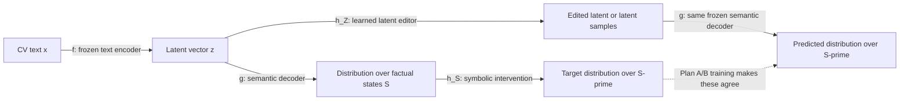
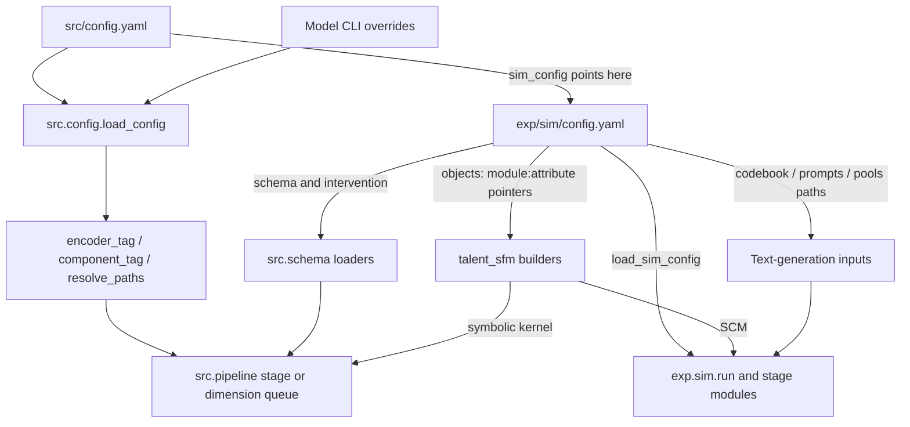
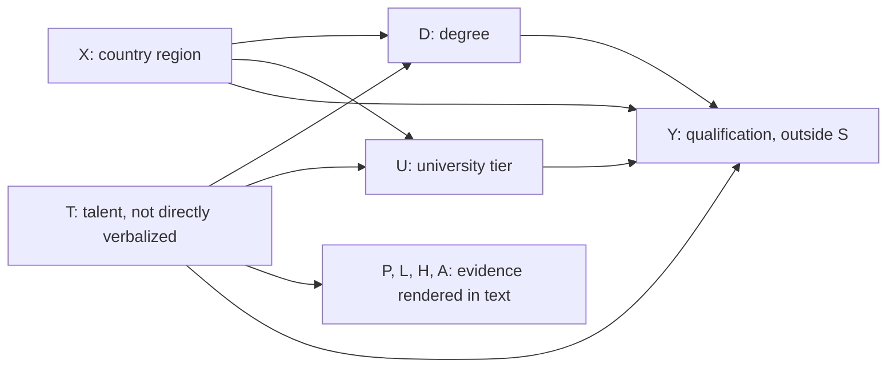
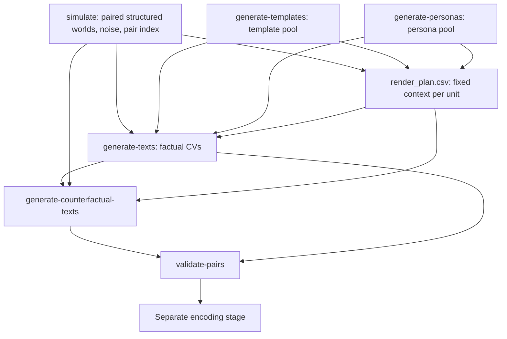
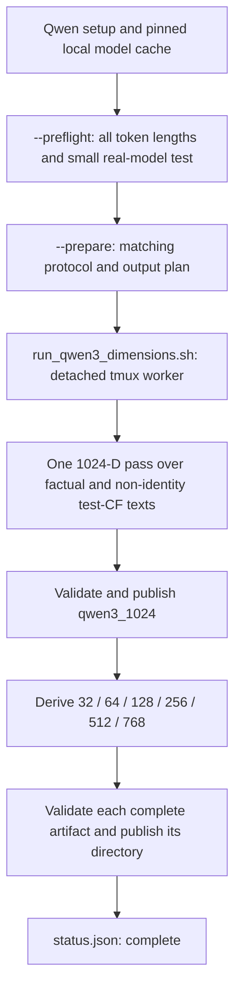
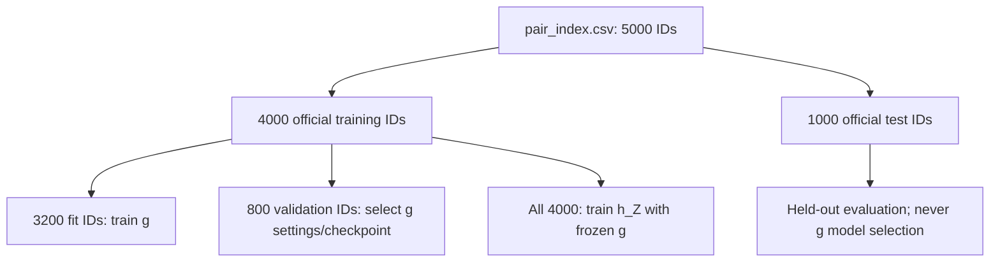

# A student's guide to the codebase

This guide explains the implementation in this checkout, using the active **talent
experiment**. The local artifact snapshot was checked on **28 September 2026**.
It is a navigation and teaching guide, not a claim that every planned experiment
has already been run.
For the subsequent behavior-preserving extraction, see the
[implementation review map](implementation_refactor.md).

Run commands from the repository root. The diagrams use **Mermaid**; open this file
in a Markdown viewer with Mermaid support. File links are relative so the guide
also works on another machine.

Suggested first tour: read sections 1–3, trace one command in sections 4–7, then
inspect an existing artifact using section 9. Do not regenerate data just to
understand the code.

## Contents

- [1. The project in one picture](#1-the-project-in-one-picture)
- [2. Repository map](#2-repository-map)
- [3. Configuration and dispatch](#3-configuration-and-dispatch)
- [4. The synthetic world and CV generation](#4-the-synthetic-world-and-cv-generation)
- [5. Text encoding and dimension queues](#5-text-encoding-and-dimension-queues)
- [6. Training the semantic decoder](#6-training-the-semantic-decoder)
- [7. Symbolic and latent interventions](#7-symbolic-and-latent-interventions)
- [8. Files on disk and compatibility checks](#8-files-on-disk-and-compatibility-checks)
- [9. How to call the code](#9-how-to-call-the-code)
- [10. Where to make changes](#10-where-to-make-changes)
- [11. Current results and implementation limits](#11-current-results-and-implementation-limits)
- [12. Tests and a teaching walkthrough](#12-tests-and-a-teaching-walkthrough)

## 1. The project in one picture

The research question is: **Can we edit a text's latent representation so that its
meaning changes in the way prescribed by a causal intervention?**

We first simulate structured candidate attributes, turn them into CV texts, and
encode the texts. We learn to recover the attributes from the embeddings, then
use that learned mapping to supervise an editor in latent space.



For the distributional editors, the intended agreement is

$$g \circ h_Z \approx h_S \circ g.$$

Composition includes averaging over uncertainty, not just comparing two argmax
labels. The deterministic baseline uses a simpler supervised objective; see
section 7.

| Name | Meaning | Main implementation | Learned here? |
| --- | --- | --- | --- |
| `f` | CV text → embedding | [encoder.py](../src/encoder.py), [qwen3_encoder.py](../src/qwen3_encoder.py) | Frozen during the main pipeline; LangVAE adaptation is a separate task |
| `g` | Embedding → distribution over structured attributes | [semantic_decoder.py](../src/semantic_decoder.py) | Yes, from factual embeddings and factual labels |
| `h_S` | Symbolic state → counterfactual-state distribution | [talent_sfm.py](../exp/sim/talent_sfm.py) builds the kernel in [symbolic.py](../exp/sim/symbolic.py) | No, the active experiment supplies known mechanisms and noise parameters |
| `h_Z` | Embedding + intervention → edited embedding/distribution | [latent_intervention.py](../src/latent_intervention.py) | Yes; `g` stays frozen during this training |

Two naming traps:

- **The semantic decoder `g` does not generate prose.** LangVAE also has a separate
  text decoder, exposed by `TextEncoder.decode()`, for latent-to-text reconstruction.
  Nomic and Qwen embeddings do not have that reconstruction path here.
- In this guide, lowercase `x` means CV text. The active SCM's uppercase **`X` is
  country-of-origin region**, not the text. `T` is talent; `z` is the text embedding.

## 2. Repository map

The main boundary is **experiment-specific data generation** in `exp/sim/` versus
**representation learning and intervention models** in `src/`. They share schema
utilities through `src/schema.py`. The model classes are largely schema-driven;
some runners and report locations are specifically arranged for the talent experiment.

```text
latent_intervention/                 # repository root; run commands here
├── README.md                        # setup and operational commands
├── pyproject.toml / uv.lock          # main Python environment
├── requirements/qwen3.in/.lock       # separate, pinned Qwen encoding environment
├── exp/sim/                         # synthetic world and text generation
│   ├── config.yaml                  # active talent experiment
│   ├── run.py                       # CLI stage dispatcher
│   ├── talent_sfm.py                # concrete causal coefficients/noise/builders
│   ├── scm.py / symbolic.py         # reusable simulation and symbolic engines
│   ├── codebook.yaml                # category meanings and verbalization rules
│   ├── prompts/                     # prompts and LLM sampling metadata
│   ├── stage_*.py                   # simulation, pools, CVs, validation, retries
│   ├── pairing.py / paired_data.py  # IDs, splits, paired structured data
│   ├── render.py / helpers.py       # fixed rendering context and resumable outputs
│   ├── generate_text.py             # LLM request/response handling
│   ├── text_length.py               # generated-text token budget
│   ├── *_cv_screening.*             # archived experiment settings
│   └── R/                           # archived R reference, not the active pipeline
├── src/                             # embeddings, models, training, evaluation
│   ├── config.yaml / config.py      # model settings and path resolution
│   ├── encoder_protocols.py         # dimensions, protocols, metadata and lazy factories
│   ├── pipeline.py                  # CLI dispatcher and stage orchestration
│   ├── schema.py                    # schema, intervention, dynamic object loading
│   ├── encoder.py                   # LangVAE and Nomic wrappers
│   ├── qwen3_encoder.py             # isolated Qwen3-Embedding-0.6B wrapper
│   ├── embeddinggemma_encoder.py    # isolated EmbeddingGemma-300m wrapper
│   ├── encoding_progress.py        # console-only encoder progress reporting
│   ├── pair_encoding.py             # canonical latent artifact and validation
│   ├── latent_writer.py             # atomic latent publication and sidecars
│   ├── nomic_encoding.py            # shared Nomic/Qwen/Gemma dimension queue
│   ├── qwen3_encoding.py            # Qwen entry point into that shared queue
│   ├── qwen3_preflight.py           # real-model smoke test and token audit
│   ├── qwen3_setup.py               # cache the pinned Qwen checkpoint
│   ├── semantic_decoder.py          # the two versions of g
│   ├── decoder_training.py          # numerical g training and validation selection
│   ├── decoder_reporting.py         # g checkpoint/progress/report bookkeeping
│   ├── decoder_experiment.py        # hyperparameter search and repeated-seed runs
│   ├── symbolic_intervention.py     # h_S interface and experiment-object loader
│   ├── latent_intervention.py       # three h_Z variants and their training loops
│   ├── artifact_io.py               # atomic writes used by latents/g/queues
│   ├── artifact_audit.py            # read-only artifact compatibility snapshots
│   └── finetune_vae.py              # optional LangVAE adaptation helper
├── scripts/                         # setup and detached tmux launchers
├── data/                            # simulation CSVs, texts, and saved embeddings
├── models/                          # trained checkpoints; Git-ignored
├── reports/                         # metrics, manifests, status, logs; Git-ignored
├── tests/                           # automated checks
├── docs/                            # this guide, architecture and research notes
└── poster/                          # publication/presentation materials
```

Start reading at [pipeline.py](../src/pipeline.py), not inside a neural network
layer. It shows which inputs a stage consumes, which implementation it calls,
and which files it writes.

## 3. Configuration and dispatch

### Two configurations, with different responsibilities



| Setting lives in | What it controls | Read by |
| --- | --- | --- |
| [exp/sim/config.yaml](../exp/sim/config.yaml): `n`, `seed`, `split`, `intervention` | Population, simulation randomness, official split and fixed `do()` query | Simulation/pairing stages; `src.schema.load_intervention()` |
| Same file: `schema` | Ordered state columns, category counts, auxiliary proxies and outcome | `load_schema()`; simulator/rendering helpers |
| Same file: `objects` | Which concrete SCM/kernel builders to import | `load_object()` / `load_config_object()` |
| Same file: `paths`, `codebook`, `prompts`, `pools` | Where simulation and text-generation inputs/outputs live | Generation stages and `render_context()` |
| Same file: `llm`, `generation`, `text_length` | Endpoint/key environment variable, call/retry limits, text-length budget | `helpers.py`, `stage_cv.py`, `text_length.py` |
| [prompts/*.yaml](../exp/sim/prompts/) | Prompt wording, model/deployment name, temperature, completion-token limit | `load_prompts()` and `generate_text_result()` |
| [src/config.yaml](../src/config.yaml): `encoder` | Encoder family, pinned checkpoints, dimensions, token limits, batch/device settings | Encoder factories, artifact validation and queues |
| Same file: `semantic_decoder` | `g` architecture, optimizer, validation, early stopping and search budget | `stage_train_decoder()` and `decoder_experiment.py` |
| Same file: `latent_intervention` | `h_Z` variant, architecture, noise, mixture size and loss weights | `stage_train_manipulator()` and variant trainers |
| Same file: `paths` | Latent/model/report path templates | `resolve_paths()` |
| Same file: `sim_config`, `finetune_vae`, global `seed` | Which experiment to read; optional VAE adaptation; training randomness | Stage orchestration and `finetune()` |

**The two `paths` blocks are not automatically merged.** `src/config.yaml` points
to the simulation config for its schema, intervention and object builders, but
also has its own explicit input paths. Switching experiments requires updating
those paths together. Relative paths are interpreted from the working directory,
so run from the repository root even when using a custom config file elsewhere.

The seeds have different jobs: `exp/sim/config.yaml: seed` draws the synthetic
population; `split.seed` assigns official train/test IDs; `src/config.yaml: seed`
controls model-training randomness; `semantic_decoder.split_seed` fixes the
training-only fit/validation holdout. They need not all have the same value.

### What happens when a model config is loaded?

In [src/config.py](../src/config.py), `load_config()`:

1. Reads `src/config.yaml`, or the path supplied through `--config`.
2. Applies encoder/decoder/manipulator and dimension CLI overrides.
3. Through `encoder_protocols.configure_encoder()`, copies the selected Qwen/Gemma
   maximum length and batch size into the active generic
   `max_len` and `batch_size` fields.
4. Validates the encoder width/protocol.
5. Calls `resolve_paths()` to substitute `{encoder}`, `{decoder}`, `{manipulator}`.

Example: `qwen3`, width `64`, `autoregressive`, `pre_additive` resolves to:

```text
data/latents/talent/qwen3_64/z_pairs.pt
models/talent/qwen3_64/g-autoregressive/semantic_decoder.pt
models/talent/qwen3_64/g-autoregressive/h-pre_additive/latent_intervention.pt
reports/talent/qwen3_64/g-autoregressive/h-pre_additive/eval.json
```

An explicit component `tag` overrides its normal directory label. Tags label
artifacts; they do not change the model implementation. Dimension queues require
`encoder.tag: null` so their standard names remain unambiguous.

Do not confuse embedding width with network width: `qwen3_latent_dim: 64` means
64 input coordinates, whereas `semantic_decoder.hidden_dim: 256` and
`latent_intervention.d_model: 128` describe internal network layers.

### Which entry point calls what?

```text
python -m exp.sim.run STAGE --config EXPERIMENT_YAML
└── exp.sim.run.main()
    ├── helpers.load_sim_config()
    └── exp.sim.run.STAGES[STAGE](config)
        └── one stage_* module; see section 4

python -m src.pipeline STAGE --config MODEL_YAML [variant/dimension flags]
└── src.pipeline.main()
    ├── src.config.load_config()
    └── src.pipeline.STAGES[STAGE](config)
        ├── encode             → stage_encode()
        ├── train-decoder      → stage_train_decoder()
        ├── train-manipulator  → stage_train_manipulator()
        └── evaluate           → stage_evaluate()
```

These are separate commands, not one automatic end-to-end run. In particular,
encoding does not also train `g`, and `train-decoder` does not train `h_Z`.

## 4. The synthetic world and CV generation

### The active experiment

The authoritative schema is [exp/sim/config.yaml](../exp/sim/config.yaml).
Its structured state is `S = (X, T, D, U)` in that order:

| Column | Meaning | Categories | Role |
| --- | --- | --- | --- |
| `X` | Country-of-origin region | 4 | Protected attribute; intervention is `do(X=3)` |
| `T` | Talent | 3 | Part of `S` and predicted by `g`, but never directly stated in CVs |
| `D` | Degree | 3 | Part of `S`, caused by `X` and `T` |
| `U` | University rank tier | 3 | Part of `S`, caused by `X` and `T` |
| `P, L, H, A` | Projects, learning speed, hard-problem solving, advice seeking | 3 each | Auxiliary evidence of `T`; rendered, but not decoder heads |
| `Y` | Qualification outcome | 3 | Simulated, but excluded from `S`, CV candidate information and current `g` heads |

There are **4 × 3 × 3 × 3 = 108** joint states. This number is unrelated to the
embedding dimension. Schema order also fixes the autoregressive decoding order
and the shared flat-state indexing used by `g` and `h_S`.



This is a synthetic experimental world, not an empirical claim about real hiring.
Mechanism coefficients and noise distributions are defined in
[talent_sfm.py](../exp/sim/talent_sfm.py), not in a neural network or prompt.

### Generation order and exact function paths



The render plan is created or checked through `render_context()` /
`ensure_render_plan()`; it is not an extra CLI stage. Templates and personas can
be prepared in either order before CV generation.

| Stage / purpose | Where the call goes | Important helpers / output |
| --- | --- | --- |
| `simulate` | [stage_simulate.py](../exp/sim/stage_simulate.py): `stage_simulate()` → configured `build_scm(config)` → `SCM.simulate()` | `build_pair_index()`; simulation CSVs, `pair_index.csv`, `simulation_info.json` |
| `generate-templates` / `generate-personas` | [stage_pools.py](../exp/sim/stage_pools.py): `stage_generate_templates()` / `stage_generate_personas()` → `_generate_rows()` | Seed statements/job titles; template/persona pool CSVs |
| `generate-texts` / `generate-counterfactual-texts` | [stage_cv.py](../exp/sim/stage_cv.py): public stage wrapper → `_generate_cv(counterfactual=...)` | `render_context()` → `RenderContext.render_inputs()` → `generate_with_attempts()` → `generate_text_result()` |
| `validate-pairs` | [stage_validate.py](../exp/sim/stage_validate.py): `stage_validate_pairs()` | ID coverage, stored rendering context, identity copies, forbidden-term and length checks |
| Retry administration | [stage_reset.py](../exp/sim/stage_reset.py): `stage_reset_attempts()` | Resets exhausted attempts for missing rows; does not generate texts itself |

Follow [scm.py](../exp/sim/scm.py): `SCM.simulate()` samples unit-level noise once
and reuses it for the factual and intervened worlds. Follow
[pairing.py](../exp/sim/pairing.py): `build_pair_index()` fixes the split and marks
structured identities; `build_render_plan()` fixes the unit's template, persona
and sampling quantiles. The same candidate must not get a new narrative context
merely because its country region is intervened on.

[render.py](../exp/sim/render.py) combines the codebook, pools, plan and paired
states into a `RenderContext`. [generate_text.py](../exp/sim/generate_text.py)
formats the prompts and makes the LLM call. [helpers.py](../exp/sim/helpers.py)
provides the shared input digests, per-ID retry journal and resume logic.

Identity counterfactuals copy the factual text without an API call. With the
current config, counterfactual text generation covers all units; setting
`generation.include_train_counterfactual_texts: false` limits it to test IDs.
This does **not** change the test-only coverage of counterfactual embeddings.

Operational cautions:

- `generate-*` stages can incur API charges. The key comes from the environment
  variable named by `llm.api_key_env`; never store it in YAML or this guide.
- `simulate` archives existing simulation/text artifacts before making a new run.
  It is not a harmless inspection command.
- Generated CSVs and their `*.generation.json` journals belong together. Digests
  prevent silently appending a different experiment to an existing file.
- Pair/grounding validation is not proof that every sentence faithfully expresses
  every attribute; semantic text quality still needs examination.

## 5. Text encoding and dimension queues

### One canonical paired artifact

```text
src.pipeline.stage_encode(config)
└── src.pair_encoding.encode_pairs(config)
    ├── _load_pair_index() / _load_csv() → align by integer ID
    ├── select every factual text and only non-identity test counterfactuals
    ├── encoder_protocols.get_encoder_factory()
    │   ├── langvae / nomic → src.encoder.make_encoder()
    │   ├── qwen3          → src.qwen3_encoder.make_qwen3_encoder()
    │   └── embeddinggemma → src.embeddinggemma_encoder.make_embeddinggemma_encoder()
    ├── encoder.encode(texts, deterministic=True, batch_size=...)
    ├── copy factual vectors into identity counterfactual rows exactly
    └── write_latent_artifact() → latent_writer.write_latent_payload()
        └── z_pairs.pt + z_pairs.info.json
```

The Qwen and EmbeddingGemma branches bypass `src.encoder` during paired encoding
because that module imports LangVAE dependencies. Their isolated environments do not need them.

| Variant | Implementation / representation | Configured widths | Inference environment |
| --- | --- | --- | --- |
| `langvae` | `TextEncoder.encode()`: pretrained LangVAE posterior mean | 128 | `.venv` |
| `nomic` | `NomicTextEncoder.encode()`: task prefix, mean pool, full-width layer norm, prefix slice, L2 normalize | 64, 128, 256, 512, 768 | `.venv` |
| `qwen3` | `Qwen3TextEncoder.encode()`: plain CV, last nonpadding token, prefix slice, L2 normalize; no Nomic-style extra layer norm | 32, 64, 128, 256, 512, 768, 1024 | `.venv-qwen3` |
| `embeddinggemma` | `EmbeddingGemmaTextEncoder.encode()`: fixed classification prompt, bidirectional mean pooling, two learned projections, prefix slice and L2 normalization | 128, 256, 512, 768 | `.venv-embeddinggemma` |

`qwen3` refers only to **Qwen3-Embedding-0.6B**, not the general chat model or larger
embedding checkpoints. `last_token_pool()` and `format_text()` are useful entry
points when inspecting its pooling and optional instruction handling.

The two environments are intentional: LangVAE currently uses Transformers 4.48.0,
while the Qwen environment pins 4.57.6 through
[requirements/qwen3.lock](../requirements/qwen3.lock). Downstream training on saved
Qwen tensors can still use `.venv`; it does not load the Qwen transformer.

### Why the queue needs only one transformer pass

Matryoshka embeddings support useful prefixes. After one full-width pass, smaller
representations are obtained by slicing and L2 renormalizing, not by retraining or
running the model six more times.



The graph groups smaller widths for readability; the queue currently handles
128 first, then the remaining smaller widths in ascending order.

Key queue functions in [nomic_encoding.py](../src/nomic_encoding.py):

| Function | Responsibility |
| --- | --- |
| `dimension_configs()` | Load one resolved config per supported width |
| `protocol()` | Record configuration, inputs, relevant source hashes and environment versions; Qwen also hashes model/tokenizer files |
| `inspect_queue()` / `verify_artifact()` | Check existing outputs before reuse; validate float32 unit-normalized vectors |
| `run_queue()` | Run the stages serially and maintain status |
| `projected_payload()` | Slice the native-width source and renormalize; preserve identity pairs |
| `compare_projection()` | Check agreement between native-width prefixes and saved smaller embeddings |
| `publish_dimension()` | Stage a complete artifact, validate it and atomically rename its directory into place |

[qwen3_encoding.py](../src/qwen3_encoding.py) calls this shared module's
`main(variant="qwen3")`. [qwen3_preflight.py](../src/qwen3_preflight.py) provides
`run_preflight()`. Nomic uses the same queue with a native width of 768 and no
Qwen-specific preflight gate.

[embeddinggemma_encoding.py](../src/embeddinggemma_encoding.py) also uses the shared
queue via `main(variant="embeddinggemma")`, with a native width of 768.
[embeddinggemma_preflight.py](../src/embeddinggemma_preflight.py) additionally checks
the complete official embedding stack and classification-prompt recipe. See the
[README setup instructions](../README.md#embeddinggemma-300m-dimensions); setup does
not start a full encoding run.

The queues lock writers, refuse incompatible/partial published outputs, and reuse
verified completed stages. An interrupted transformer pass **restarts**; there is
no per-batch resume. Code/config/input changes can invalidate a run ID or Qwen
preflight. Do not bypass those checks to force a resume.

## 6. Training the semantic decoder

`g` predicts the full structured state, not a hiring decision. The two supported
versions live in [semantic_decoder.py](../src/semantic_decoder.py):

| Variant | Class | Factorization | How predictions work |
| --- | --- | --- | --- |
| `independent` | `SemanticDecoder` | Product of per-column distributions given `z` | Shared MLP trunk, one categorical head per column |
| `autoregressive` | `SemanticAutoRegDecoder` | Product conditioned on `z` and preceding state values | MLP features plus embeddings of earlier categories; teacher forcing during training |

Both expose `log_joint(z)` with shape `(batch, 108)` for this experiment. The
autoregressive `predict(z)` is greedy; `log_joint(z)` enumerates the full joint.
Do not call its `forward(z)` without targets as though it were the independent
model: teacher-forced `forward()` requires them.

### The split is defined by IDs, not CSV row positions



The 3,200/800 split comes from the current `calibration_split: 0.2`. Despite its
historical name, it is a **validation holdout**. ECE is reported descriptively;
no temperature-scaling model is fitted. Validation results are not test results.

```text
src.pipeline.stage_train_decoder(config)
├── load_latent_artifact()                  # checked tensors and official IDs
├── load_schema()                          # ordered X, T, D, U heads
├── _aligned_targets(sim_factual, ids, ...) # labels aligned to latent IDs
├── _official_indices() / _fit_calibration_split()
├── make_semantic_decoder(variant, latent_dim=artifact.z.shape[1], ...)
├── DecoderTrainingRun(...)                # protocol/checkpoint/report bookkeeping
├── decoder_training.train_semantic_decoder(...)
│   ├── minibatch optimization on fit IDs
│   ├── joint_nll() on validation IDs
│   ├── LR scheduler and early stopping
│   ├── DecoderTrainingRun.checkpoint_epoch() → best checkpoint and progress JSON
│   └── restore best validation weights before returning
└── DecoderTrainingRun.finish() → final checkpoint, split IDs, history and metrics
```

The default is **at most 500 epochs**, not exactly 500: learning-rate reduction and
30-epoch early-stopping patience apply. `train_semantic_decoder()` lives in
[decoder_training.py](../src/decoder_training.py), re-exported by the model module
for compatibility. Dataset loading/splitting remain in the pipeline, and
[decoder_reporting.py](../src/decoder_reporting.py) handles publication and reports.
These are small networks trained on cached vectors, not transformer fine-tuning.

For comparisons, use `joint_nll()`: the independent model's training `nll()` averages
over columns, while the autoregressive `nll()` is a full-joint loss. Raw training
losses are therefore not on the same scale.

### One fit versus an experiment sweep

[decoder_experiment.py](../src/decoder_experiment.py) wraps the same stage:

```text
main()
└── run_case() for each entry in CASES
    ├── candidate_settings() → 20 common hyperparameter candidates
    ├── run_config() → separate search/seed output locations
    ├── execute_run() → stage_train_decoder() or verify a completed run
    ├── choose lowest validation joint NLL
    └── train selected settings for five seeds, verify and summarize
main() → publish_results() → archive old active files and publish verified replacements
```

`CASES` currently selects **LangVAE and Nomic × independent and autoregressive**;
with the default config Nomic means 128-D. It does not discover every latent
folder, include Qwen, or sweep every embedding width. Seed 42 is the predeclared
active model; it is not chosen as the luckiest seed.

## 7. Symbolic and latent interventions

### Where does `h_S` actually come from?

[src/symbolic_intervention.py](../src/symbolic_intervention.py) defines a protocol
(an expected interface) and loader, **not the concrete causal mechanisms**.

```text
src.symbolic_intervention.load_symbolic_kernel(sim_config)
├── src.schema.load_config_object("symbolic_kernel", sim_config)
│   └── load_object("exp.sim.talent_sfm:build_symbolic_kernel")
│       └── return the builder function; do not call it yet
└── builder(sim_config)
    └── exp.sim.talent_sfm.build_symbolic_kernel(sim_config)
        └── exp.sim.symbolic.SymbolicIntervention.from_scm(...) → kernel object

Methods available on that returned kernel:
├── counterfactual(state, delta)
├── transition_matrix(delta)  # sparse 108 x 108 matrix
└── compose(g_probs, delta)   # push a distribution through it
```

The `module:attribute` string means “import this module and retrieve this
function”; the loader then calls the builder with the experiment config. The
active kernel is analytic, not another MLP to train. `SymbolicIntervention.fit()`
exists for estimating noise parameters in another setting, but the active builder
uses known simulator parameters through `from_scm()`.

### The three editors are separate from the two decoders

All editor classes and trainers are in
[src/latent_intervention.py](../src/latent_intervention.py).

| Config variant | Class / trainer | What gets learned and what supervises it |
| --- | --- | --- |
| `baseline` | `LatentIntervention` / `train_latent_intervention()` | One residual latent edit; frozen `g` predicts the simulated counterfactual labels `S'`, with shift penalties. The trainer does not use `h_S`. |
| `pre_additive` | `LatentInterventionPreAdditive` / `train_latent_intervention_preadditive()` | Noise-driven edits; Monte Carlo estimate of `g ∘ h_Z`, matched to `h_S ∘ g` using forward KL plus shift penalties. This trainer does not use the passed `S'` labels. |
| `dist` | `LatentInterventionDist` / `train_latent_intervention_dist()` | A distribution over counterfactual states plus a latent realizer. Pretraining uses both symbolic distribution targets and simulated `S'` labels; joint training matches the composed distributions over the retained top-k components. |

`_DeltaNet` is the shared residual network: a projected latent token and
condition tokens enter a transformer layer. `_DoSpecTokens` embeds the intervention
or proposed target state. The output is initialized to zero, so the residual editor
starts as an identity mapping.

The orchestration is:

```text
src.pipeline.stage_train_manipulator(config)
├── load_latent_artifact() → use factual z for official training IDs
├── load_semantic_decoder() → check encoder/schema/upstream hashes
├── load_intervention() and load_symbolic_kernel()
├── _aligned_targets(sim_counterfactual, ...) → structured S-prime labels
├── choose the h_Z class and train_* function by variant
│   └── shared _train()
│       ├── freeze g parameters; keep gradients through g back to edited z
│       ├── make_objective() → intervention values and mask tensors
│       ├── consistency_target() for pre_additive/dist
│       │   └── decoder.log_joint() and symbolic transition_matrix()
│       └── variant loss + _penalties() → update h_Z only
└── save latent_intervention.pt and its .info.json provenance
```

The stage currently loads both the structured counterfactual labels and the
symbolic kernel before selecting a variant, even when that variant's trainer does
not use one of them. Distinguish this file dependency from the mathematical loss.

There is no training target of “make edited `z` equal the encoded counterfactual
CV.” **Structured counterfactual labels `S'` are not counterfactual embeddings
`z_prime`.** They have different roles.

### What `evaluate` currently does

`stage_evaluate()` requires both a matching trained `g` and `h_Z`. It loads the
official test IDs, applies `h_Z`, predicts attributes through `g`, and reports:

- factual decoder accuracy and descriptive calibration;
- edited-state accuracy against simulated counterfactual labels, per column;
- average L1/L2 latent shift and factual-vector norm.

It does **not currently compute** a distance to the stored `artifact.z_prime`,
counterfactual text reconstruction quality, a full distributional consistency
benchmark, or outcome fairness metrics. It evaluates `forward()`: one sampled edit
for `pre_additive`, or the highest-weight state's realization for `dist`.
The general research goal is broader than this current evaluation report.

## 8. Files on disk and compatibility checks

### Data files are not interchangeable

| File / family | Contains | Main consumers |
| --- | --- | --- |
| `data/sim_talent/sim_data_factual.csv` | Simulated factual attributes, including auxiliary columns and outcome | CV rendering; factual `g` labels |
| `sim_data_counterfactual.csv` in the same folder | Same units under the fixed intervention | Counterfactual rendering; baseline/dist supervision; evaluation |
| `sim_data_epsilon.csv` | Per-unit simulator noise | Simulation provenance/reproducibility; not the encoder's direct input |
| `pair_index.csv` | Unit ID, official split, identity flag | Pair validation, encoding and every training/evaluation split |
| `render_plan.csv` | Fixed template/persona and sampling quantiles per ID | Text generation and grounding checks; not transformer inference |
| `data/text_talent/cv_factual.csv`, `cv_counterfactual.csv` | Text plus generation/rendering metadata | `encode_pairs()` |
| `data/text/templates.csv`, `personas.csv` | Shared narrative/persona pools | Rendering, not downstream decoder training |
| `z_pairs.pt` and `z_pairs.info.json` | Embedding tensors plus exact provenance | `g`, `h_Z`, evaluation and artifact checks |

Canonical latent payload for width `d`:

```text
ids          : 5000 integer IDs, aligned with z
z            : tensor [5000, d], factual embeddings
test_ids     : 1000 integer IDs, aligned with z_prime and is_identity
z_prime      : tensor [1000, d], encoded test counterfactual texts
is_identity  : bool tensor [1000]; 256 identities in the current data
```

`LatentArtifact.train_ids` is derived from the validated IDs and official test
membership; it is not a separate saved tensor. For identity pairs the
counterfactual vector is copied exactly, not recomputed approximately.

### Paths separate experiment choices

```text
data/latents/talent/{encoder}/
├── z_pairs.pt
└── z_pairs.info.json

models/talent/{encoder}/g-{decoder}/
├── semantic_decoder.pt
└── h-{manipulator}/
    ├── latent_intervention.pt
    └── latent_intervention.info.json

reports/talent/{encoder}/g-{decoder}/
├── semantic_decoder.json
├── semantic_decoder.progress.json
└── h-{manipulator}/eval.json

reports/talent/{nomic,qwen3}_dimensions/{run-id}/
└── protocol.json, plan.json, run.log, launcher.log, status.json
    # Qwen additionally requires preflight.json

reports/talent/decoder_experiments/{run-id}/
└── protocol/source snapshot, status, results and publication manifests
```

The decoder sweep additionally keeps trials/seeds under the model/report
combination's `experiments/{run-id}/` directories and backs up old active files.

Use [pair_encoding.py](../src/pair_encoding.py): `load_latent_artifact()` instead
of treating `torch.load()` as the complete validation step. The loader checks
checksums, source text/pair hashes, encoder identity, dimensions, IDs, shapes,
finite values and identity semantics. Semantic-decoder and pipeline checkpoint
loaders additionally check the relevant upstream artifact/schema metadata.

An encoder change—even at the same width—requires new embeddings and newly trained
dependent models. A dimension change is not merely a filename edit.

[artifact_io.py](../src/artifact_io.py) supplies atomic per-file writes for the
paired latents, semantic decoders and queue reports; the dimension queue adds
atomic publication of complete output directories. Do not assume this applies to
every write in the repository: the current manipulator checkpoint uses its own
`torch.save()` path.

Git is not a backup of everything. Models, reports, environments and caches are
ignored. Canonical dimension-stamped Nomic/Qwen embeddings are explicitly
trackable, but new files still need to be committed and pushed. Copy ignored
model/report artifacts separately when moving to another machine.

## 9. How to call the code

### Safe first inspection: no training or API calls

These commands use the existing main environment:

```bash
.venv/bin/python -m src.pipeline --help
.venv/bin/python -m exp.sim.run --help
```

Inspect a resolved config and the actual schema without loading a transformer:

```bash
.venv/bin/python - <<'PY'
from src.config import load_config
from src.schema import load_schema, load_intervention, n_states

cfg = load_config(
    encoder_variant="qwen3", qwen3_dim=64,
    decoder_variant="autoregressive", manipulator_variant="pre_additive",
)
columns, outcome = load_schema(cfg["sim_config"])
print([(c.name, c.n_categories) for c in columns])
print("joint states:", n_states(columns), "outcome:", outcome.name)
print("intervention:", load_intervention(cfg["sim_config"]))
for key in ("latents", "decoder_model", "manipulator_model", "eval_report"):
    print(key, "->", cfg["paths"][key])
PY
```

Load existing Qwen embeddings and build the small symbolic matrix. This also
shows that downstream inspection does not require `.venv-qwen3`:

```bash
.venv/bin/python - <<'PY'
import torch
from src.config import load_config
from src.pair_encoding import load_latent_artifact
from src.schema import load_intervention
from src.symbolic_intervention import load_symbolic_kernel

torch.set_num_threads(2)
cfg = load_config(encoder_variant="qwen3", qwen3_dim=128)
artifact = load_latent_artifact(cfg)
kernel = load_symbolic_kernel(cfg["sim_config"])
matrix = kernel.transition_matrix(load_intervention(cfg["sim_config"]))
print("z:", tuple(artifact.z.shape), "z_prime:", tuple(artifact.z_prime.shape))
print("train/test:", len(artifact.train_ids), len(artifact.test_ids))
print("symbolic matrix:", tuple(matrix.shape))
rows = matrix.to_dense().sum(dim=1)
assert torch.allclose(rows, torch.ones_like(rows))
PY
```

Expected shapes are `(5000, 128)`, `(1000, 128)`, and `(108, 108)`.

### Launchers and stage commands: these do perform work

The full workflows are documented in the [root README](../README.md) and
[data-generation README](../exp/sim/README.md). Relevant entry points:

| Intent | Entry point | Effect / prerequisite |
| --- | --- | --- |
| Set up Qwen on a new machine | `bash scripts/setup_qwen3.sh` | Installs isolated dependencies and downloads the pinned checkpoint |
| Audit Qwen before a queue | `.venv-qwen3/bin/python -m src.qwen3_encoding --preflight` | Token audit and bounded real-model inference |
| Prepare Qwen outputs | `.venv-qwen3/bin/python -m src.qwen3_encoding --prepare` | Writes a plan after a matching preflight |
| Run all Qwen widths | `bash scripts/run_qwen3_dimensions.sh` | Detached tmux queue; matching preflight/protocol required |
| Run all Nomic widths | `bash scripts/run_nomic_dimensions.sh` | Detached native-width/derived-width queue |
| Train one `g` | `.venv/bin/python -m src.pipeline train-decoder --encoder-variant qwen3 --qwen3-dim 128 --decoder-variant independent` | Uses saved embeddings; writes the selected active decoder/model report |
| Train one `h_Z` | `.venv/bin/python -m src.pipeline train-manipulator --encoder-variant qwen3 --qwen3-dim 128 --decoder-variant independent --manipulator-variant pre_additive` | Requires the matching trained `g`; writes a manipulator |
| Evaluate that combination | `.venv/bin/python -m src.pipeline evaluate --encoder-variant qwen3 --qwen3-dim 128 --decoder-variant independent --manipulator-variant pre_additive` | Requires both models; writes a held-out report |

Do not run the table as a classroom setup script. Embeddings already exist here;
old queue run IDs can reject changed code/configs. `train-decoder` and
`train-manipulator` write to their selected paths and can replace that combination's
active model. Different variant paths prevent cross-variant collisions, **not**
repeated-run overwrites within the same variant.

For a small isolated teaching fit, call the stage directly and give it fresh
output paths. This example is illustrative; it was not run when writing the guide:

```python
from pathlib import Path
from src.config import load_config
from src.pipeline import stage_train_decoder

cfg = load_config(
    encoder_variant="qwen3", qwen3_dim=128, decoder_variant="independent",
)
cfg["paths"]["decoder_model"] = "models/student_demo/g/semantic_decoder.pt"
cfg["paths"]["decoder_report"] = "reports/student_demo/g/semantic_decoder.json"
assert not Path(cfg["paths"]["decoder_model"]).parent.exists()
assert not Path(cfg["paths"]["decoder_report"]).parent.exists()
cfg["semantic_decoder"]["epochs"] = 3  # demonstration only, not research training
stage_train_decoder(cfg)
```

Use a new directory for another demo. Low-level functions take Python dictionaries
and tensors; the CLI is a wrapper around the same functions, not a separate model
implementation. After `load_config()` resolves paths, changing a variant field
in that dictionary does not magically re-resolve the already-expanded paths;
reload with the appropriate overrides instead.

## 10. Where to make changes

| Student asks… | Start here | Consequence to remember |
| --- | --- | --- |
| “Where is the causal relationship defined?” | `talent_sfm.py`: coefficient/noise dictionaries and builders | Changing the synthetic world needs a deliberate new dataset and dependent artifacts |
| “Where are category meanings or CV wording defined?” | `codebook.yaml` versus `prompts/cv_generation.yaml` | Semantics/realizations and prompt prose are different layers; generation digests matter |
| “Where do the state variables and head order come from?” | `exp/sim/config.yaml: schema.columns`, then `src/schema.py` | Changing order also changes flat-state indices and autoregressive conditioning |
| “Where is the intervention selected?” | `exp/sim/config.yaml: intervention` | Existing paired data encode one fixed query; changing YAML does not transform old data |
| “Where do I choose encoder width?” | `src/config.yaml` or `--nomic-dim` / `--qwen3-dim` | New latent space, separate `g` and `h_Z` |
| “Where is token pooling implemented?” | `NomicTextEncoder.encode()` or `last_token_pool()` / `Qwen3TextEncoder.encode()` | Pooling is part of the representation protocol, not a harmless refactor |
| “Where do I change epochs, learning rate, validation?” | `semantic_decoder` settings; `train_semantic_decoder()`; pipeline split helpers | 500 is a ceiling; test IDs must stay out of selection |
| “Where do I add another decoder or editor?” | Factory/variant dispatch, its model module, config, CLI and tests | A new class alone is not enough; loading and metadata must support it |
| “Where do I add Qwen/dimension search to the g sweep?” | `decoder_experiment.py: CASES`, config construction and experiment paths | Current `CASES` does not sweep dimensions automatically |
| “Where would paired latent-recovery metrics go?” | `pipeline.py: stage_evaluate()` and the paired artifact contract | Use test `z_prime`; do not leak test targets into training/model selection |
| “Where are units assigned to train/test?” | `pairing.build_pair_index()` and persisted `pair_index.csv` | Never make a fresh downstream random split of the whole dataset |
| “Where is readable CV reconstruction tuned?” | Separate LangVAE adaptation workflow; `finetune_vae.py` is the local helper | Changing `f` invalidates embeddings and dependent models |

## 11. Current results and implementation limits

Local snapshot, **28 September 2026**, based on the artifact directories and
completion records—not merely on what classes are implemented:

| Component | Present in this checkout |
| --- | --- |
| Factual CVs and paired simulation | 5,000 units; official 4,000/1,000 train/test split |
| Stock LangVAE embeddings | `langvae`, 128-D |
| Nomic embeddings | `nomic_64`, `nomic_128`, `nomic_256`, `nomic_512`, `nomic_768` |
| Qwen3-Embedding-0.6B embeddings | `qwen3_32`, `qwen3_64`, `qwen3_128`, `qwen3_256`, `qwen3_512`, `qwen3_768`, `qwen3_1024` |
| EmbeddingGemma-300m embeddings | `embeddinggemma_128`, `embeddinggemma_256`, `embeddinggemma_512`, `embeddinggemma_768`; completed 28 September at 20:12 CEST |
| Active trained `g` checkpoints | Independent and autoregressive for stock LangVAE and Nomic 128-D |
| Trained `g` for other widths/Qwen | Not present in the active model paths at this snapshot |
| `h_S` | Constructed analytically on demand; no trained checkpoint required |
| Active trained `h_Z` checkpoints | No `latent_intervention.pt` found under `models/talent/` at this snapshot |
| LangVAE fine-tuning on another GPU server | Separate work; no claim here about that server's state |

Further boundaries worth explaining:

- Available embeddings do not prove that `g` can recover every attribute well.
  In particular, `T` must be inferred from noisy proxies rather than read directly.
- Stock LangVAE has a text decoder, but in-domain CV reconstruction quality is a
  separate question. Nomic/Qwen have no latent-to-text decoder in this pipeline.
- Nomic/Qwen outputs are unit-normalized. The current residual editors do not
  automatically project edits back onto that sphere; penalty settings and latent
  geometry need attention when comparing encoders and widths.
- `finetune_vae.py` defaults to `paths.texts` and makes its own random holdout; it
  does **not** enforce the official pair split. For a clean held-out study, choose
  a separate adaptation corpus or explicitly restrict it to allowed training IDs.
- Some research notes, especially [problem_formulation.md](problem_formulation.md)
  and [architecture/symbolic_intervention.md](architecture/symbolic_intervention.md),
  still use the archived CV-screening variables and 3,456-state examples. For the
  current experiment's names, dimensions and actual call paths, use the active
  config and source code. The archived config is
  [config_cv_screening.yaml](../exp/sim/config_cv_screening.yaml).

## 12. Tests and a teaching walkthrough

Run the existing test suite from the main environment:

```bash
.venv/bin/python -m pytest -q
```

The suite uses small fixtures/fake encoders for most checks. Qwen's real-model
preflight is separate; passing unit tests alone is not a complete real-data run.

| Test files | Useful questions they answer |
| --- | --- |
| [test_config_paths.py](../tests/test_config_paths.py), [test_config_propagation.py](../tests/test_config_propagation.py) | Do variants, widths, paths and experiment settings propagate correctly? |
| [test_pairing_pipeline.py](../tests/test_pairing_pipeline.py), [test_text_length.py](../tests/test_text_length.py) | Are pairs, rendering context, retries and token budgets handled correctly? |
| [test_encoder.py](../tests/test_encoder.py), [test_qwen3_encoder.py](../tests/test_qwen3_encoder.py) | Are model loading, dimensions, pooling and deterministic encoding correct? |
| [test_pair_encoding.py](../tests/test_pair_encoding.py), [test_nomic_encoding.py](../tests/test_nomic_encoding.py) | Do ID/provenance checks, both dimension queues, derivation, resume and preflight gates work? |
| [test_semantic_decoder.py](../tests/test_semantic_decoder.py), [test_semantic_pipeline.py](../tests/test_semantic_pipeline.py) | Do probabilities, both decoder variants, training and checkpoint guards work? |
| [test_decoder_experiment.py](../tests/test_decoder_experiment.py) | Does the search/repetition/publication workflow behave correctly on small fixtures? |

A practical 25-minute explanation:

1. **Five minutes:** draw the `f`, `g`, `h_S`, `h_Z` picture. Ask the student which
   component generates text and which predicts attributes.
2. **Five minutes:** open both configs side by side. Follow `sim_config`,
   `schema.columns`, and `objects.symbolic_kernel`; resolve a Qwen path example.
3. **Five minutes:** inspect one paired latent artifact with the read-only example.
   Explain why `z` has 5,000 rows while `z_prime` has 1,000.
4. **Five minutes:** trace `stage_train_decoder()` into `train_semantic_decoder()`.
   Identify the fit/validation/test boundaries and where the best weights are saved.
5. **Five minutes:** trace the symbolic builder and compare the three editor
   objectives. End with what `evaluate` currently measures and what is still missing.

For deeper model details, read the architecture notes for
[text encoders](architecture/text_encoder.md),
[semantic decoders](architecture/semantic_decoder.md), and
[latent interventions](architecture/latent_intervention.md), keeping the active
config/source authoritative when older examples differ.
