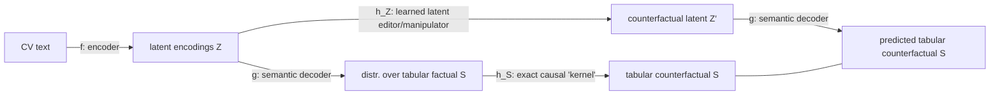
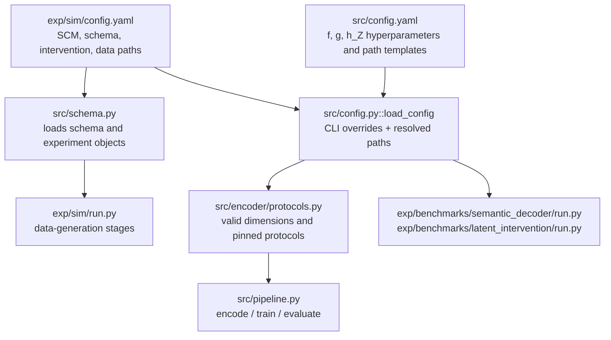
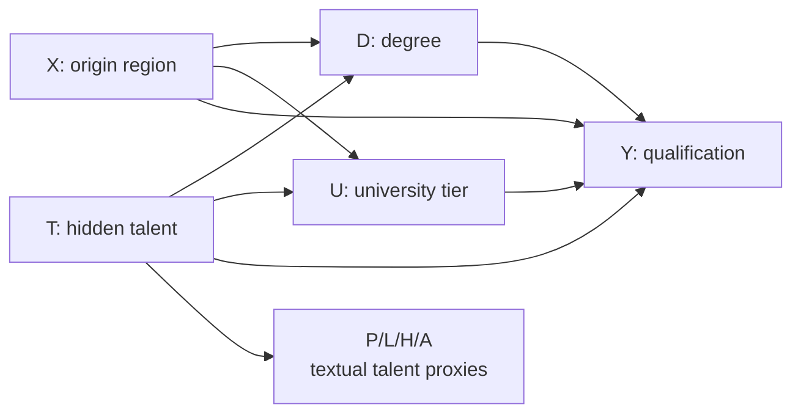
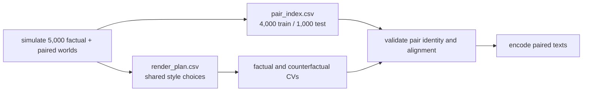
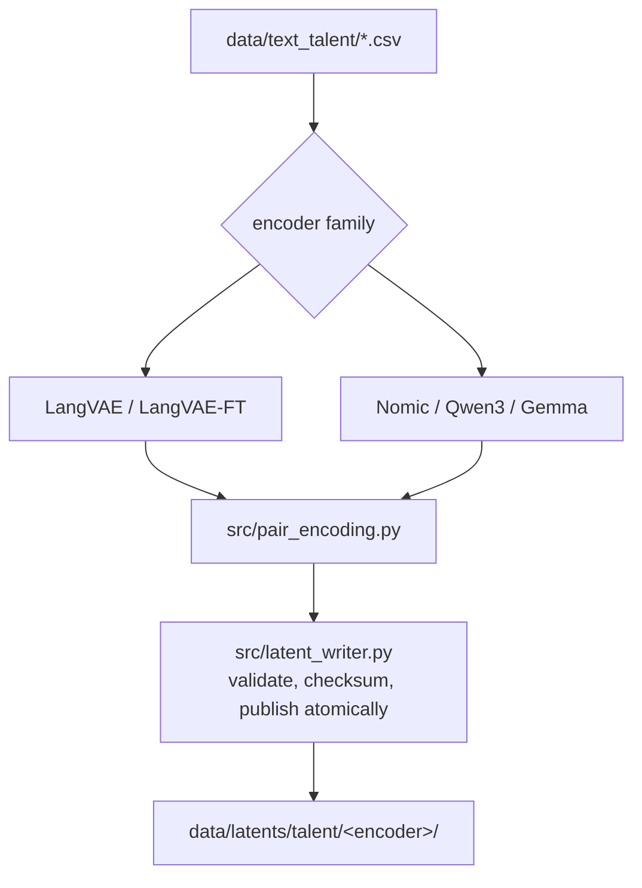
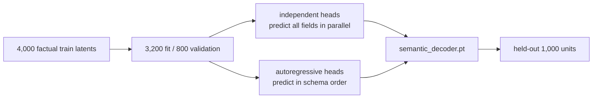
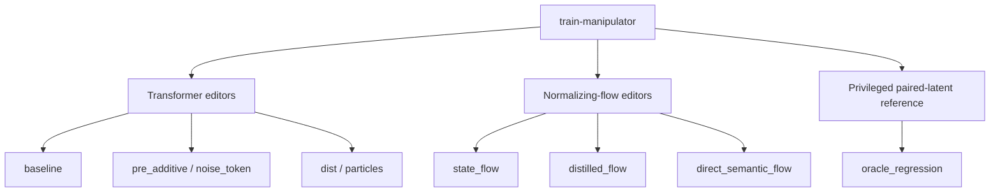
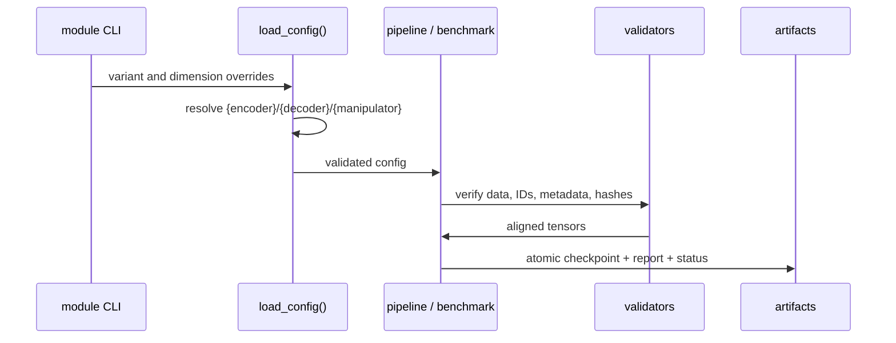

# Veeeery high level guide to the codebase guide

Hope this helps a littl...

## 1. General idea

- `f` is one of the encoder (they are pre-trained, taken from the internet; there exist maaany, we try a dozen of them, more info later).
- `g` predicts the structured state \(S=(X,T,D,U)\). This is not the LangVAE decoder.
- `h_S` is computed analytically from the known DAG.
- `h_Z` is the object currently being benchmarked (this we want to make perfect and get awards for this).

## 2. Geeeeneral code structure

| Specs | Main file | Main implementation |
|---|---|---|
| causal variables, intervention `do(...)` specification, sample count etc | `exp/sim/config.yaml` | `exp/sim/talent_sfm.py` |
| encoder specs | `src/config.yaml` / CLI | `src/encoder/protocols.py` |
| locations info of all objects created during training | `src/config.yaml:paths` | `src/config.py`, `src/latent_writer.py` |
| \(g\) architecture and training procedure | `src/config.yaml:semantic_decoder` | `src/semantic_decoder/model.py`, `src/semantic_decoder/training.py` |
| \(h_Z\) benchmark matrix | `configs/hz_benchmark.yaml` | `exp/benchmarks/latent_intervention/*.py` |

## 3. DAG

We changed the setup from LIBERTY and instead use this DAG (A bit similar to that of Drago):

Simulation procedure on a high level:

## 4. All encoders we use and how we train it

| Encoder family | Canonical folders | Dimensions |
|---|---|---|
| LangVAE (out of the box) | `langvae` | 128 |
| LangVAE (we fine tuned this one on CV, doesnt seem to work well as of now)| `langvae_ft` | 128 |
| Nomic Embed v1.5 | `nomic_{d}` | 64, 128, 256, 512, 768 |
| Qwen3-Embedding-0.6B | `qwen3_{d}` | 32, 64, 128, 256, 512, 768, 1024 |
| EmbeddingGemma-300M (preliminary buuuut: seems to be the best by a big difference) | `embeddinggemma_{d}` | 128, 256, 512, 768 |

All **18** spaces are stored seperately in a folder sturcture following `data/latents/talent/<encoder>/`. Each `z_pairs.pt` combines factual latents, held-out counterfactual latents, IDs, and identity flags. 

Procedure:

## 5. How we train g()

We currently test two different MLP implementation. One with independent heads and on with autoregressive heads at the last layer. Broad setup looks like this:

Both g versions have the same 500-epoch-budget for training and we allow for early-stopped. In total we arrive at **18 encoders × 2 decoder versions (g) = 36 factual predictions S**. Among those we choose the one which performs best in predicting the tabular data S (currently Gemma 768 in combination with the independent g head).

## 6. Then we have 9 (!!!) candidates for $h_Z$

3 arhcitectures are based on a transformer setup, 3 on normalizing flows and one an MLP that simply maps from Z to Z' so it can see the true outcome, this is a simple baseleine for model uncertainty. 

## 7. Setup of the training pipeline

| Task | Entry point |
|---|---|
| generate or validate the corpus | `python -m exp.sim.run <stage>` |
| run one pipeline stage | `python -m src.pipeline <stage> ...` |
| build the all-encoder \(g\) matrix | `python -m exp.benchmarks.semantic_decoder.run` |
| prepare/run/resume the \(h_Z\) matrix | `python -m exp.benchmarks.latent_intervention.run` |
| audit artifact compatibility | `tools/artifact_audit.py` |
