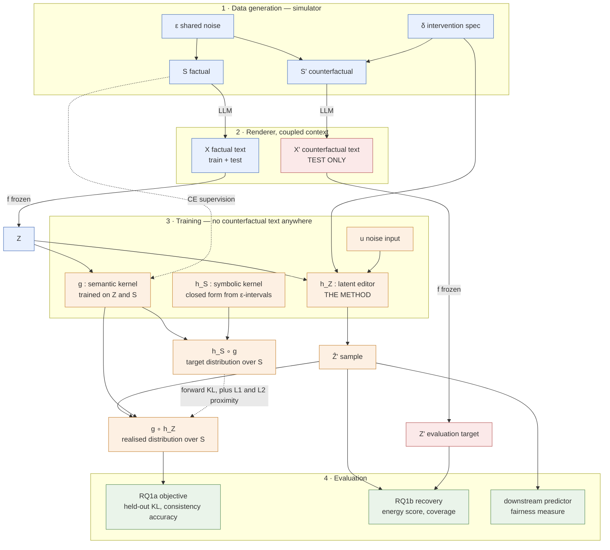

# Experiments

Study design only. **Notation, model definitions and the training objective live in
`architecture.md`** — $f$ (frozen encoder), $g$ (semantic kernel), $h_S$ (symbolic
counterfactual kernel), $h_Z$ (latent editor, the method), and the consistency objective
$D_{\mathrm{KL}}(h_S \circ g \,\|\, g \circ h_Z)$. Symbols are used here as defined there.

The one commitment that drives every study design below: **$Z'$ never enters a loss.** It is the
evaluation target only.

---

## Study 1 — Simulation study

### Research question

Does the objective $D\big((h_S \circ g)(\cdot\mid z,\delta),\ (g \circ h_Z)(\cdot\mid z,\delta)\big)$,
which uses **no counterfactual text**, train an $h_Z$ that recovers the counterfactual latent
$Z'$ the simulator actually produces?

Two sub-questions, to be reported separately:

- **RQ1a (optimisation).** Does $h_Z$ minimise the objective on held-out data?
- **RQ1b (identification).** Does minimising it recover $Z'$? These can come apart — the
  objective constrains $z'$ only in directions $g$ can read.

### Data

1. Simulate tabular data: factual $\mathbf S$ and counterfactual $\mathbf S'$ under $\delta$,
   sharing exogenous noise $\varepsilon$.
2. Generate factual texts $X$ for train **and** test.
3. Generate a complete counterfactual-text artifact for the **test set only**:
   - rows already at the target value are their own counterfactuals ($X' = X$ exactly) —
     never pay for these; under $do(\texttt{G}{=}1)$ that is ~50% of rows;
   - generate $X'$ for every remaining nonidentity test unit. Ambiguous strata (those where
     $\mathbf S'$ is not determined by $\mathbf S$) can be reported separately or reweighted
     during evaluation, without changing the random unit split or generation coverage.
4. Split **by unit**: all worlds of one simulated candidate stay in the same split.

### Function Derivation

See `architecture.md`. For this study: $h_S$ is **closed form** (abduction gives a factorised
truncated-normal noise posterior, pushed forward by exact enumeration into a sparse
$3456\times3456$ transition matrix per $\delta$), $g$ is the **autoregressive** kernel trained
on factual pairs $(f(X), \mathbf S)$ only, and $h_Z$ is the **discrete mixture** — with
pre-additive engression as the alternative under test (see the ablation table).

Two things to settle empirically before committing:

- **Top-$k$ truncation of the distillation target.** $(h_S \circ g)$ is a $g$-weighted mixture,
  so its support can reach $14K$ for $g$-support $K$; the max-14 figure is a property of a single
  row of $M_\delta$, not of the composed target. Measure the composed support per stratum before
  fixing $k$ — it will be widest in exactly the ambiguous rows this study is about.
- **Adversarial drift.** $\Delta_\phi$ is fit against a frozen $g$, which is the
  adversarial-example construction. The identity check and RQ1b must be read before any RQ1a
  number is trusted.

### Baselines and ablations

Required for the numbers to be interpretable — a cosine similarity has no meaning without a
floor and a ceiling.

| | Role |
|---|---|
| Identity, $z' = z$ | floor: how much does *any* edit help |
| Deterministic $h_Z$ (current `src/latent_intervention.py`) | is the stochastic kernel needed at all |
| Pre-additive engression $h_Z$ (Design A) | does explicit discrete-mode structure beat implicit noise-folding |
| Oracle-$\mathbf S'$ editor (fed the true $\mathbf S'$) | separates *causal reasoning* error from *realisation* error |
| Paired regressor trained on $Z'$ | ceiling: uses information the real method cannot have |
| $\alpha = \beta = 0$ | is proximity carrying the identification |

### Evaluation

- **Objective (RQ1a):** held-out KL between the two composed distributions; per-column and
  joint accuracy of $g(h_Z(z))$ against $\mathbf S'$.
- **Recovery (RQ1b):** distance between the sample $\{z'_m\} \sim h_Z(\cdot \mid f(X), \delta)$
  and the true $Z' = f(X')$. Since $h_Z$ is a *distribution* and $Z'$ a point, use a proper
  score (energy score) — not cosine similarity to a single output. Report cosine/L2 of the
  sample mean as a secondary, comparable-to-prior-work number.
- **Calibration:** coverage of $Z'$ by the predicted distribution; is the spread real or
  degenerate.
- **Directions that matter:** agreement of a downstream predictor evaluated at $h_Z(z)$ vs at
  $Z'$. Partial identification in the predictor-relevant subspace may be all the application
  needs.
- **Identity check:** rows where $\mathbf S' = \mathbf S$ must map to $z' \approx z$.

---

## Study 2 — Real data, annotations available

### Research question

Does the method work when $\mathbf S$ comes from a real corpus rather than a renderer —
i.e. when $g$ must be learned against human-assigned labels and the text distribution is not
generated from $\mathbf S$?

> **Open problem:** this study still needs an $h_S$, which needs a *causal model of the real domain*.
> That is a harder dependency than the annotations, and the previous draft's with-$g$ / without-$g$ split does not capture it. Three things can be given or missing — texts, annotations, SCM — and the SCM is the binding constraint. Candidate resolutions:
> borrow an SCM from the fairness literature for the domain, or restrict to domains where a defensible one exists.

### Data

Real dataset with text + structured attributes. To be selected.

### Function Derivation

For Studies 2/3 there is no known SCM, so $h_S$ must be learned there. Design the interface so the analytic and learned versions are interchangeable — same signature, h_S(s, delta) -> sparse vector over S.

### Evaluation

No $X'$ exists, so RQ1b is unavailable. Evaluate through the downstream predictor: outcome
distribution with and without $h_Z$, against the declared fairness measure, plus the
consistency objective on held-out data.

---

## Study 3 — Real data, annotations produced by us

### Research question

Does the method survive when $\mathbf S$ is inferred rather than given — i.e. how much does
annotation noise in $g$'s training data degrade $h_Z$?

### Data

Real dataset, annotated with structured features (LLM-assisted or manual; report agreement).

### Evaluation

As Study 2, plus sensitivity of the results to annotation quality — this is the study's own
contribution, and can be *pre-tested in simulation* by corrupting $\mathbf S$ labels.

---

## Study 4 — Benchmarking

### Research question

How does the method compare to existing counterfactual-generation and latent-steering
approaches on the same downstream measure?

### Comparisons

To be fixed. Candidate families: SAE steering, activation addition / representation editing,
counterfactual text generation, and counterfactually-fair predictors.

### Evaluation

Downstream predictor outcome under each method's edit, on a common held-out split and a
common fairness measure.

---

## Pipeline

Red = simulator-only, available at evaluation but never in a loss and never at deployment.
Dashed = supervision.

---

## Remaining open decisions

The query set is fixed to the single intervention $do(\texttt{G}{=}1)$; no query grid or
orbit is generated.

1. **Sample size** from transition support: count rare transitions in a large cheap tabular run before committing to billed text generation.
2. **Study 2/3 domain**, driven by where a defensible SCM exists.
3. **Fairness measure** to be declared before results are computed.
