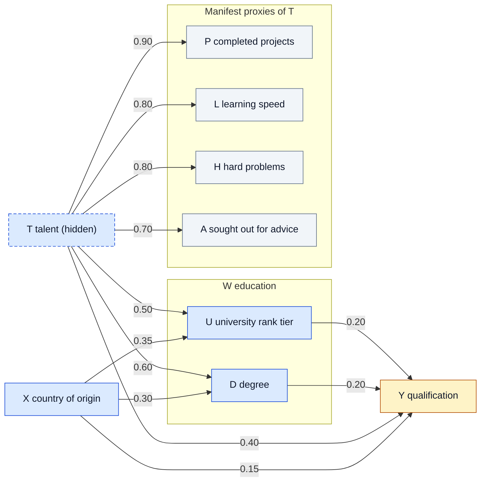

# `exp/sim` — the talent SFM experiment

Everything experiment-specific lives here: the concrete SCM, the codebook and
prompts that verbalize a structured state into a CV, and the stage runner that
produces the paired data. The generic framework in `src/` reaches this folder
only through a sim config (default `exp/sim/config.yaml`, selected by
`sim_config` in `src/config.yaml`, read via `src/schema.py`), never by importing
it directly.

**Active experiment — talent SFM** (`config.yaml`, `talent_sfm.py`). This is the
standard fairness model of Plecko & Bareinboim:

- **X**: country of origin. 4 regions, and a concrete country is sampled per region.
- **T**: talent, the SFM's confounder Z, renamed so it doesn't clash with the latent space.
- **W**: mediators D (degree) and U (globally anchored university rank tier).
- **Y**: qualification, the outcome.

Talent is abstract and never stated in the text. It reaches the text only
through four behavioural proxies, all caused by T alone:

- P: completed projects
- L: learning speed
- H: solving hard problems
- A: being sought out for advice

The proxies are **auxiliary**: simulated and verbalized so T can be inferred
from the text, but they are not part of the structured state. So:

- S = {X, T, D, U} and |S| = 108.
- The symbolic kernel over S stays exact.
- Under do(X), T and the proxies stay unchanged.



Blue nodes form S (dashed: T, decoded but never verbalized); grey nodes are the
auxiliary proxies; Y is the outcome. Edge labels are the linear mechanism
weights from `talent_sfm.py`; X and T are independent roots.

The text generation keeps the LIBERTy App. D.3 recipe and adds an evidence block:
the proxies are written "show, don't tell", at their exact level.
Run `uv run python -m exp.sim.talent_sfm` for the proxy correlations, Cronbach's
α and the Bayes-optimal T accuracy, which is the ceiling for the decoder's T head.

**Archived experiment — LIBERTy CV screening** (`config_cv_screening.yaml`,
`cv_screening.py`, `codebook_cv_screening.yaml`,
`prompts/cv_generation_cv_screening.yaml`). This reproduces the **CV Screening
dataset of the LIBERTy paper** (arXiv 2601.10700): the structural equations are
its Table 9, and text generation follows its Appendix D.3. Its artifacts stay in
`data/sim/` and `data/text/cv_*.csv`. Rerun any stage with
`--config exp/sim/config_cv_screening.yaml`. `exp/sim/R/` holds the original R
simulation of that SCM, kept as the reference implementation (own README, own
`renv`). The talent SFM is Python-only.

## The pipeline

Run everything from the repository root. Every `generate-*` stage is **billed** —
one API call per generated row, with identity copies free — so read
[Cost and resumption](#cost-and-resumption) first.

```bash
uv run python -m exp.sim.run simulate                      # S, S', epsilon, pair_index.csv
uv run python -m exp.sim.run generate-templates            # 50 calls  -> templates.csv
uv run python -m exp.sim.run generate-personas             # 100 calls -> personas.csv
uv run python -m exp.sim.run generate-texts                # n calls   -> cv_factual.csv
uv run python -m exp.sim.run generate-counterfactual-texts # configured train/test coverage -> cv_counterfactual.csv
uv run python -m exp.sim.run validate-pairs                # checks the whole contract
```

Order matters: `simulate` first, the two pools in any order, then the factual
texts, then the counterfactual ones. `validate-pairs` re-checks everything and
is safe to run at any point once the files exist.

One maintenance stage makes no calls of its own:

```bash
uv run python -m exp.sim.run reset-attempts   # let IDs that burned their retries be retried
```

Smoke tests that need no API key or generated data:

```bash
uv run python -m exp.sim.scm            # generic SCM engine on random tensors
uv run python -m exp.sim.talent_sfm     # the active talent SFM: proxy validity, do(X) invariance
uv run python -m exp.sim.cv_screening   # the archived Table 9 equations
uv run python -m exp.sim.symbolic       # the closed-form kernel h_S of the active config
```

## File map

### Stages — one module per stage, dispatched by `run.py`

| File | Role |
| --- | --- |
| `run.py` | CLI only: maps a stage name to its module and calls it. Start here. |
| `stage_simulate.py` | `simulate`. Runs the SCM, builds the seeded split, archives the previous run's artifacts. |
| `stage_pools.py` | `generate-templates` and `generate-personas`. Two thin wrappers over one billed row loop. |
| `stage_cv.py` | `generate-texts` and `generate-counterfactual-texts` — one routine parameterized by world. |
| `stage_validate.py` | `validate-pairs`. Coverage plus the cross-world checks that need X and X' side by side. |
| `stage_reset.py` | `reset-attempts`. Clears spent retry budgets for IDs with no row yet. |

### Shared layers used by the stages

| File | Role |
| --- | --- |
| `helpers.py` | Config loading, digests, and the resumable billed-output core (see below). No experiment knowledge. |
| `paired_data.py` | Structured S/S': `simulation_record`, `load_pair_inputs`, and the fixed-do()-query check. |
| `render.py` | `RenderContext` — codebook spec, pools, render plan and S/S' bundled — plus `validate_grounding`. |
| `pairing.py` | Pure functions: the seeded split, the render plan, bin materialization, `PairingError`. |
| `generate_text.py` | LLM plumbing. `generate_text_result` against any OpenAI-compatible endpoint. |

### The experiment definition

| File | Role |
| --- | --- |
| `config.yaml` | Talent SFM: n, seed, split, the do() query, the schema (incl. `auxiliary`), object pointers, paths, prompts, billing caps. |
| `talent_sfm.py` | **The only place the talent-SFM numbers live.** `build_scm()`, `build_symbolic_kernel()`, `talent_posterior_accuracy()`. |
| `codebook.yaml` | Talent SFM level semantics: phrases, labels, `hidden` (T), `bins` (P), `choices` (countries per region), `evidence` (L, H, A guidance), `forbidden_terms`. |
| `prompts/cv_generation.yaml` | Talent SFM CV prompt: Box D.14 plus the show-don't-tell evidence block. |
| `prompts/{template,persona}_generation.yaml` | LIBERTy boxes D.12 and D.13; the pools they produced are shared by both experiments. |
| `*_cv_screening.*`, `cv_screening.py` | The archived LIBERTy Table 9 experiment (config, codebook, CV prompt, SCM). |
| `seed_statements.yaml`, `job_titles.yaml` | Curated inputs the two pool stages draw from. |

### Generic engines (no node names, reusable)

| File | Role |
| --- | --- |
| `scm.py` | Linear-Gaussian(+callable) SCM. `simulate()` reuses the factual noise, so pairs are exact. |
| `symbolic.py` | Closed-form linear-Gaussian symbolic counterfactual kernel `h_S`. |

## What the pipeline guarantees

**Exact pairs.** The counterfactual simulation reuses the factual noise, so unit
`i` in `sim_data_counterfactual.csv` is the same unit under the configured do()
query (`do(X=3)` for the talent SFM).

**One fixed context per unit.** `render_plan.csv` pins a template, a persona, and
one quantile per sampled field (binned number or choice option) for each unit.
X and X' therefore differ only by the intervened state — not by a resampled
number, a different country position within the region, or a different narrative voice.
`validate_grounding` replays the plan against each written CSV to prove it.

**Free identity counterfactuals.** For units already at the intervention target,
S' equals S, so X' is copied from X with no API call and `generation_mode` is
recorded as `identity_copy` rather than `generated`.

**Counterfactual-text coverage is configurable.** By default (`true` or omitted),
`generation.include_train_counterfactual_texts` creates X' for every unit;
setting it to `false` creates X' for test units only. Training X' does not enter
the current training losses, and counterfactual recovery evaluation remains on
the held-out test units.

## Cost and resumption

Each billed stage writes its CSV one row at a time next to a journal,
`<output>.generation.json`, holding the input digest, the expected IDs, the
per-ID attempt count, and coverage. This gives you:

- **Resume**: re-running a stage skips IDs already in the CSV.
- **A cap**: `generation.limit` in `config.yaml` bounds the billed calls per run
  (`null` = no cap). Useful for a 5-row trial before committing to all of them.
- **Refusal to mix runs**: if the config, prompts, or upstream files changed, the
  digest no longer matches and the stage fails *before* making a call rather than
  appending rows from a different setup.
- **A retry budget**: `generation.max_attempts` (1–3) calls per ID, counted across
  resumes. A response is rejected unless it has non-empty text, `finish_reason`
  `stop`, and a model name.

Generated texts are **tracked in git** (they cost credits), unlike the rest of
`data/`. Two operational notes:

- Re-running `simulate` archives the previous run's simulation *and* text outputs
  with a `_YY-MM-DD` suffix rather than overwriting them. Re-running it twice in
  one day fails instead of colliding.
- A retry budget is counted across resumes, so an ID that burned its attempts on a
  transient outage would otherwise fail every later run without calling. Run
  `reset-attempts` to clear the budget of IDs that never produced a row; written
  rows and every digest are left untouched.

## Configuration

`config.yaml` is the single source of truth for the schema:

- `schema.columns` maps each structured column to its cardinality in decode order.
- `schema.auxiliary` (optional) lists columns that are simulated and verbalized
  but are not part of S. They are in the sim CSVs and the codebook, but not in
  the decoder heads, the consistency loss or the pair identity check.
  `src/` ignores them.
- `schema.outcome` names the downstream outcome (Y), which is simulated but
  excluded from the codebook, the decoder heads and the consistency loss. `objects` holds dotted `module:attr`
pointers so `src/` can build the SCM and the symbolic kernel without importing
this package.

Sampling parameters (model, `max_completion_tokens`, temperature) live in each
prompt YAML's `metadata`, not here. For Azure, `model` must be the **deployment
name**. The CV prompt is required to be `temperature: 0` — paired generation has
to be deterministic.

The API key is read from the environment variable named by `llm.api_key_env`
(default `AZURE_OPENAI_API_KEY`). Never put the key in the config.

The codebook blocks, all optional except `columns`:

| Block | Meaning |
| --- | --- |
| `columns`, `labels` | Phrase per level and display name for every verbalized column (schema columns + auxiliary − hidden). |
| `hidden` | Schema columns that are decoded but never verbalized (T). |
| `bins` | Numeric ranges; a concrete number is sampled inside the level's range. |
| `choices` | Option lists per level. The render-plan quantile picks one, and the CV CSV stores its index. |
| `evidence` | Not stated as a fact: rendered as writing guidance into the prompt's `{evidence_guidance}` block. |
| `forbidden_terms` | Inlined into the prompt as `{forbidden_terms}`; `validate-pairs` reports texts that use them. |

If you change the structural equations in `talent_sfm.py`, keep `schema` here in
sync and rerun its smoke test. For `cv_screening.py`, also keep the R reference
in `R/utils/sim_scm.R` in sync.
