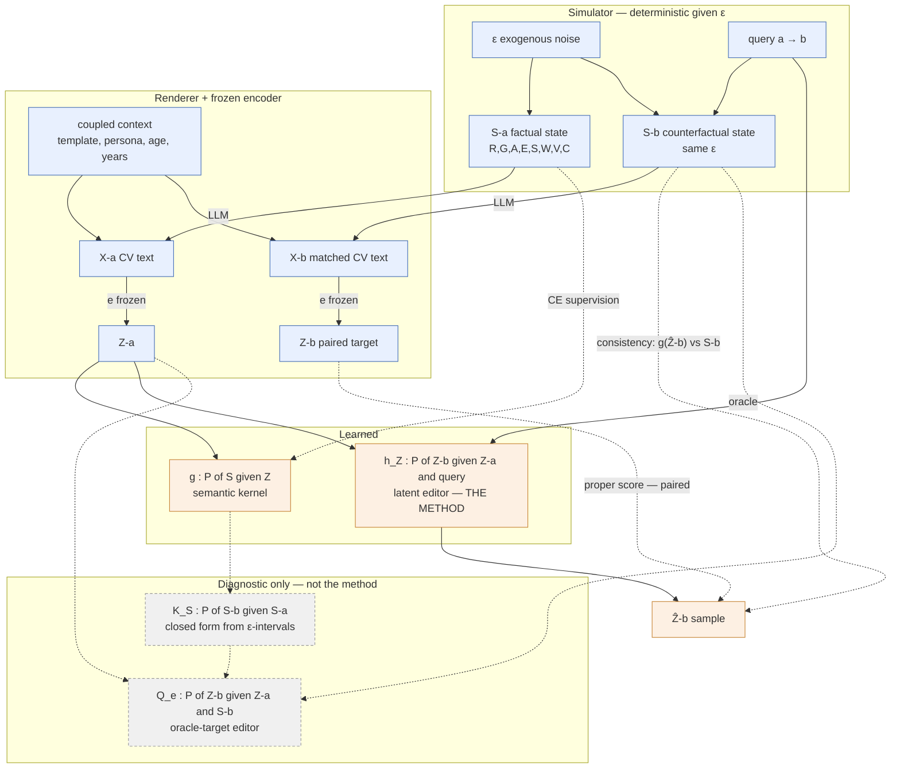

# Approaches to latent interventions

## SAE-based steering
- SAEs are not invertible
- reconstruction error deters intervention

Task of $g$: separate noise from signal
Task of $h_Z$: adjust only signal

## Stochastic kernels and where the causal work lives (2026-08-16)

Response to `notes/philip/26-08-07_stochastic-kernel_user.qmd`.

### 1. Both kernels are stochastic — but for epistemic reasons

A mechanism being deterministic **given all its inputs** does not make the conditional
distribution **given the inputs we actually have** deterministic. The stochasticity comes
from marginalising out inputs we never observe at inference. It is not noise we inject
for its own sake.

**$g: Z \to S$.** The encoder $e$ being deterministic makes $Z = e(X)$ a function, but $g$
inverts the *other* direction, and two collapses sit in between:

- $S \to X$ is one-to-many — template, persona, concrete age/years inside the bin, LLM sampling.
  So $S \to X \to Z$ is already a kernel before the encoder is considered.
- $X \to Z$ is many-to-one — a 128-dim posterior mean of a 512-token CV is lossy.
  `S=1` and `S=2` can both render as "some publications" and land at the same $Z$.

So $P(S \mid Z)$ has genuine mass on several levels wherever the renderer washed out a
distinction. `src/semantic_decoder.py` already emits exactly this (per-column categorical
heads, CE loss) — the revision is to **stop collapsing it with argmax**, not to rebuild it.
Open gap: independent per-column softmaxes assume the S columns are conditionally
independent given $Z$, which is false (E, S, W, V, C are coupled through the SCM).
Fine as a training loss, wrong joint to *sample* from.

Whether $P(S \mid Z)$ is actually spread is an **empirical question** — check held-out
posterior entropy, not just accuracy.

**$K_S: S^a \to S^b$.** This one is *provable* from our own SCM, and is the sharper point.
$S^b = F(\varepsilon, do(b))$ is deterministic given $\varepsilon$ — that is the stored-noise
oracle in `exp/sim/scm.py`, and it is why the oracle needs no training loss and must never
be used at deployment. At inference we condition on $S^a$, not $\varepsilon$, and abduction
does **not** recover $\varepsilon$ because `clip_round` is many-to-one: observing a category
pins the continuous noise only to an *interval*.

Worked example, stratum $R=1, A=1, G=0, E=1$: parents give $0.4 \cdot 2 = 0.8$, so
$E = 1 \Rightarrow \varepsilon_E \in [-0.3, 0.7)$. Under $do(G{=}1)$ the parent term becomes
$1.2$, and $E^b$ flips at $\varepsilon_E = 0.3$ — a threshold strictly *inside* the abducted
interval:

| | $E^b = 1$ | $E^b = 2$ |
|---|---|---|
| simulation ($n \approx 16.7$k in stratum) | 0.548 | 0.452 |
| analytic (truncated $N(0.35, 0.5)$) | 0.55 | 0.45 |

Near a coin flip, from a fully deterministic SCM. Not a corner case: sweeping all factual
states of $(R,G,A,E,S,W,V,C)$, **46.9% of the probability mass** sits on factual states
admitting more than one counterfactual state under $do(G{=}1)$. A deterministic $K_S$ is
wrong on roughly half the data.

Corollary: discretisation is what destroys counterfactual identifiability here. The residual
entropy of $P(\varepsilon \mid S^a)$ *is* the kernel's spread — and it is available in closed
form (truncated Gaussians), so $K_S$ can be **calculated rather than fitted**.

### 2. The conditioning fork

GPT's $Q_e$ conditions on $(Z^a, S^a, S^b, a, b)$. Two arguments, not equally strong.

**$S^a$ — weak, drop it.** If $g$ is any good, $S^a$ is approximately a function of $Z^a$,
so it adds no information; and at inference it is a *sample* from $g$, injecting $g$'s errors
into the editor's input on top of already having $z$. GPT half-concedes this (labels it an
ablation). Keep it only as that ablation.

**$S^b$ — the real fork.** $h_Z(z, do)$ is a *function*, but $P(Z^b \mid Z^a, do)$ is not a
point mass (see the 46.9% above). One point is being asked of a genuinely multi-valued
target, and CE against a single $S'$ drives $h_Z$ to a compromise between incompatible
answers. Two coherent ways out, differing only in **where the ambiguity is placed**:

| | **A — ours** | **B — GPT's** |
|---|---|---|
| Editor input | $Z^a$, query $a \to b$ | $Z^a$, $S^b$, query |
| Ambiguity lives in | the editor: $h_Z$ itself is a kernel | $K_S$; editor stays ~deterministic |
| SCM at inference | not needed | required |
| $g(h_Z(z)) \approx S'$ as a metric | meaningful | **near-vacuous** |

Formally B is a *factorisation* of A:

$$H(Z^b \mid z, a{\to}b) = \sum_{S^a, S^b} Q_e(Z^b \mid z, S^b)\, K_S(S^b \mid S^a)\, G_e(S^a \mid z)$$

equal to A iff $S$ is causally sufficient. B's genuine attraction: it moves the
provably-nondegenerate part into $K_S$, where we can compute it in closed form.

### 3. Decision

**Keep A as the method.** Three reasons, in order of weight:

1. **B kills our headline metric.** Consistency accuracy asks whether $g(h_Z(z))$ hits $S'$.
   Feed $S^b$ to the editor and we have handed it the answer, then scored it on reproducing
   the answer. The evaluation grounding the neurosymbolic claim stops testing anything.
2. **B weakens the claim.** "A latent operator that internalises the causal model" becomes
   "a latent renderer for an externally supplied target state" — more ordinary, and it needs
   the SCM live at deployment, which we do not have for real CVs.
3. **B compounds errors.** Its inputs are samples from $K_S$ applied to samples from $g$.
   A conditions only on what is known exactly at inference: $z$ and the requested query.

**Change to make on our side:** keep the signature $h_Z(z, a{\to}b)$, but output a
*distribution* over $Z^b$ instead of a point, and — once matched orbits exist — train against
the paired $Z^b$ with a proper score, not only the $g$-consistency loss. Cheap
architecturally: the do-spec tokens stay, only the output head of
`src/latent_intervention.py` changes.

**Role for B:** a diagnostic, not a competitor. An oracle-$S^b$ editor is an upper bound that
decomposes $h_Z$'s error into *failure to reason* about the counterfactual vs *failure to
realise* a known target in latent space.

### 4. Framework

Solid edges = data flow, dashed = supervision. Everything in the top two boxes is known
exactly at training time and unavailable at deployment except $z$ and the query.

### 5. Consequences for the build

- Matched orbits ($X^b$, hence $Z^b$) are a prerequisite for **any** of this — currently we
  verbalise the factual state only. Confirms Philip's "do not start the full billed run yet".
- $K_S$ should be derived analytically from the truncated-noise intervals, not learned;
  cross-check against the stored-noise oracle.
- Report held-out **entropy/calibration** of $g$ and $h_Z$, not only accuracy — that is what
  decides whether the stochastic framing was needed at all. If both collapse to point masses,
  the honest result is that the kernel is effectively deterministic for this
  simulator + encoder.
- The per-column independence assumption in `SemanticDecoder` needs revisiting before any
  joint sampling of $S$.