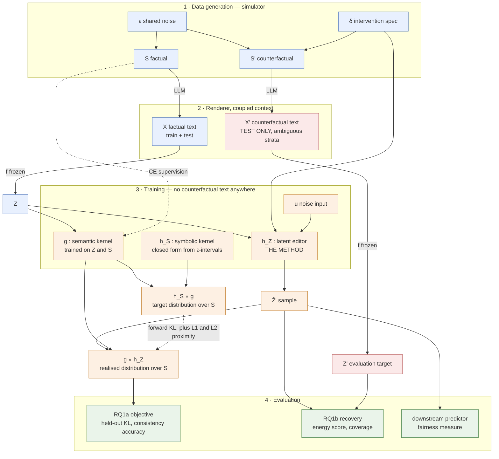

# Experiments

## Notation

Fixed once here; used consistently below.

| Symbol | Meaning |
|---|---|
| $\mathcal X, \mathcal Z, \mathcal S$ | text space, latent space ($\mathbb R^{128}$), structured state space |
| $\mathbf S = (\texttt{R},\texttt{G},\texttt{A},\texttt{E},\texttt{S},\texttt{W},\texttt{V},\texttt{C})$ | structured state; $\lvert\mathcal S\rvert = 4\cdot2\cdot3\cdot4\cdot3\cdot3\cdot2\cdot2 = 3456$ |
| $\texttt{Q}$ | downstream outcome, excluded from $\mathbf S$ |
| $\delta$ | intervention spec, e.g. $\delta = do(\texttt{G}=1)$ |
| $'$ | counterfactual under $\delta$ (so $\mathbf S'$, $X'$, $Z'$) |
| $f: \mathcal X \to \mathcal Z$ | encoder, **frozen** |
| $g(\mathbf s \mid z)$ | semantic kernel, $\mathcal Z \to \Delta(\mathcal S)$ |
| $h_S(\mathbf s' \mid \mathbf s, \delta)$ | symbolic counterfactual kernel, $\mathcal S \to \Delta(\mathcal S)$ |
| $h_Z(z' \mid z, \delta)$ | latent editor, $\mathcal Z \to \Delta(\mathcal Z)$ — **the method** |

Three notation fixes over the previous draft:

- **$f$, not $e$**, for the encoder (matches the extended abstract). And $h_Z$ consumes a
  latent, so the composition is $h_Z(f(X))$ — never $f(h_Z(X))$.
- **Kernels are written as conditionals, not as arrows into a density.** Write
  $g(\mathbf s \mid z)$, not $g: Z \to p(S \mid Z)$; the arrow form should name *spaces*
  ($\mathcal Z \to \Delta(\mathcal S)$), not elements.
- **Bold $\mathbf S$ for the state vector**, upright $\texttt{S}$ for the SCM node of the same
  name. These are different objects and the collision is otherwise unreadable.

### The two composed distributions

Both live on $\mathcal S$, which is why they are directly comparable — and $\lvert\mathcal S\rvert = 3456$
is small enough to **enumerate exactly**, so no sampling approximation and no per-column
independence assumption is needed:

$$(h_S \circ g)(\mathbf s' \mid z, \delta) = \sum_{\mathbf s \in \mathcal S} h_S(\mathbf s' \mid \mathbf s, \delta)\, g(\mathbf s \mid z)$$

$$(g \circ h_Z)(\mathbf s' \mid z, \delta) = \mathbb E_{z' \sim h_Z(\cdot \mid z, \delta)}\big[\,g(\mathbf s' \mid z')\,\big]$$

Training objective for $h_Z$ (frozen $f$, $g$, $h_S$):

$$\mathcal L = \mathbb E_{z}\Big[\, D_{\mathrm{KL}}\big(\,(h_S \circ g)(\cdot \mid z,\delta)\ \big\|\ (g \circ h_Z)(\cdot \mid z,\delta)\,\big) \,\Big] + \alpha \lVert z' - z\rVert_1 + \beta \lVert z' - z \rVert_2^2$$

Direction matters: **forward** KL is mass-covering, which is what we want — $h_Z$ must not
collapse onto one mode when the symbolic counterfactual is genuinely ambiguous.

### Guiding principle

$Z'$ **never enters a loss.** It is the evaluation target only. $g$ exists precisely because
$Z'$ is unavailable outside the simulator; supervising on $Z'$ would make the method
untransferable and $g$ redundant. See `notes/leo/idea.md`.

---

## Study 1 — Simulation study

### Research question

Does the objective $D\big((h_S \circ g)(\cdot\mid z,\delta),\ (g \circ h_Z)(\cdot\mid z,\delta)\big)$,
which uses **no counterfactual text**, train an $h_Z$ that recovers the counterfactual latent
$Z'$ the simulator actually produces?

Two sub-questions, to be reported separately:

- **RQ1a (optimisation).** Does $h_Z$ minimise the objective on held-out data?
- **RQ1b (identification).** Does minimising it recover $Z'$? These can come apart — the
  objective constrains $z'$ only in directions $g$ can read.

### Data

1. Simulate tabular data: factual $\mathbf S$ and counterfactual $\mathbf S'$ under $\delta$,
   sharing exogenous noise $\varepsilon$.
2. Generate factual texts $X$ for train **and** test.
3. Generate counterfactual texts $X'$ for the **test set only**, and only for the strata
   where they are informative:
   - rows already at the target value are their own counterfactuals ($X' = X$ exactly) —
     never pay for these; under $do(\texttt{G}{=}1)$ that is ~50% of rows;
   - among the rest, oversample the **ambiguous strata** (those where $\mathbf S'$ is not
     determined by $\mathbf S$ — 46.9% of mass, see `notes/leo/idea.md`). These are where
     the stochastic claim is actually tested.
4. Split **by unit**: all worlds of one simulated candidate stay in the same split.

### Function Derivation

#### 1. Symbolic intervention $h_S$

- Available in closed form
- No sampling error, no fitting.
- empirical numbers above are then a validation check, not the source

##### Noise Abduction

- given the full factual state $\mathbf s$, every parent of every node is observed, so the noise posterior factorises,

$$p(\varepsilon \mid \mathbf s) = \prod_i \mathrm{TruncNormal}\big(\varepsilon_i;\ \mu_i,\ \sigma_i,\ [l_i, u_i)\big)$$

- with the interval obtained by inverting clip_round against the node's mechanism $m_i = m_i(\mathbf{pa}_i)$:
  - interior, $0 < s_i < k_i - 1$: $\varepsilon_i \in [,s_i - m_i - 0.5,\ s_i - m_i + 0.5,)$
  - floor, $s_i = 0$: $\varepsilon_i \in (-\infty,\ 0.5 - m_i)$
  - ceiling, $s_i = k_i - 1$: $\varepsilon_i \in [,k_i - 1.5 - m_i,\ \infty)$
- Clipping is what makes the boundary categories carry unbounded noise mass, which is why $\texttt{E}=0$ and $\texttt{E}=3$ rows behave differently from interior ones

##### Action and Prediction
- Then $\mathbf s' = F(\varepsilon, \delta)$ is deterministic, so push the factorised posterior forward in topological order by exact enumeration.
- With $\lvert\mathcal S\rvert = 3456$ you can precompute the whole thing as a sparse $3456 \times 3456$ transition matrix per $\delta$ — mean 5.8 nonzeros per row, so a few MB — and $h_S$ becomes a lookup at train time

#### 2. Semantic bridge $g$

- Train on factual pairs $(f(X), \mathbf S)$ only.

##### OLD Approach: Independent per-column Softmaxes
- asserts $\texttt{E},\texttt{S},\texttt{W},\texttt{V},\texttt{C}$ are conditionally independent given $z$ (not true)
- KL objective compares distributions over $\mathcal S$, so a wrong joint corrupts the loss itself, not just a reported metric.

##### Approach A: Flat Joint Softmax

- Flat softmax with a head for each element of the power set of the tabular features
- Correct joint, trivially
- spends capacity on all impossible states
- few effectively-populated classes to learn from however many texts you generate
- Sparse tails, poor calibration where it matters.

##### Approach B: Autoregressive over the Topological Order (preferred) 

- $\texttt{R},\texttt{G},\texttt{A},\texttt{E},\texttt{S},\texttt{W},\texttt{V},\texttt{C}$: $p(\mathbf s \mid z) = \prod_i p(s_i \mid s_{<i}, z)$
- Exact — no independence assumption — but with one small heads for each feature
- Impossible states get zero mass structurally rather than by being learned
- Keep the existing trunk, feed embeddings of the already-decoded prefix.

- Possible trap:
  - condition each head on the full prefix, not on the node's SCM parents.
  - Given $z$, the variables are all coupled — the posterior does not inherit the SCM's factorisation
  - Restricting to parents would be a second, subtler independence error.

Both forms let you enumerate $\mathcal S$ exactly for the KL, and the autoregressive one still permits exact enumeration by expanding the product over the 2263 supported states.

#### 3. Latent intervention $h_Z$

- Freeze $f, g, h_S$
- train $h_Z$ on the objective above
- noise input to $h_Z$ lets it internalise $h_S$'s ambiguity
- **no SCM is needed at inference**

- discrete ambiguity (is $\texttt{E}'$ 1 or 2)
- induces distinct, separated regions of latent space
- residual Gaussian $z' = z + \mu_\theta + \sigma_\theta \odot u$ will place mass between the modes —-> "averaging incompatible targets" failure

$$h_Z(z' \mid z, \delta) = \sum_{\mathbf s'} w_\theta(\mathbf s' \mid z, \delta); q_\phi(z' \mid z, \mathbf s')$$

- $w_\theta$ is an internal head with the same autoregressive architecture as $g$
- $q_\phi$ is a residual realiser, $z' = z + \Delta_\phi(z, \mathbf s')$.
- At inference: sample $\mathbf s' \sim w_\theta$, then $z'$
- Only $z$ and $\delta$ are inputs — $h_S$ is internalised in $w_\theta$'s weights, so nothing from Design B leaks into deployment.

- Objective decomposes:
$$(g \circ h_Z)(\cdot \mid z,\delta) = \sum_{\mathbf s'} w_\theta(\mathbf s' \mid z,\delta)\ \mathbb E_{q_\phi}\big[g(\cdot \mid z')\big]$$

- Good realiser gives $\mathbb E_{q_\phi}[g(\cdot \mid z')] \approx \delta_{\mathbf s'}$ --> KL collapses to $D_{\mathrm{KL}}\big((h_S \circ g),|,w_\theta\big)$
- --> splits one hard bilevel problem into two ordinary supervised ones:
  - $w_\theta$: distil the exact 3456-vector $(h_S \circ g)(\cdot \mid z, \delta)$. Dense target, no sampling, no gradient-through-samples variance. Top-$k$ truncation at $k=16$ is lossless given the max of 14.
  - $q_\phi$: minimise $-\log g(\mathbf s' \mid z + \Delta_\phi(z,\mathbf s')) + \alpha\lVert\Delta\rVert_1 + \beta\lVert\Delta\rVert_2^2$ against frozen $g$. Then fine-tune end-to-end on the true KL to absorb the $\approx$. Pretrain-then-joint, not either alone.

- structurally close to GPT's $G \to K \to Q$, with $w_\theta$ playing $K_S$'s role
- Two differences that matter both survive
  - **$Z'$ never enters a loss**
  - **inference needs no SCM**

### Baselines and ablations

Required for the numbers to be interpretable — a cosine similarity has no meaning without a
floor and a ceiling.

| | Role |
|---|---|
| Identity, $z' = z$ | floor: how much does *any* edit help |
| Deterministic $h_Z$ (current `src/latent_intervention.py`) | is the stochastic kernel needed at all |
| Oracle-$\mathbf S'$ editor (fed the true $\mathbf S'$) | separates *causal reasoning* error from *realisation* error |
| Paired regressor trained on $Z'$ | ceiling: uses information the real method cannot have |
| $\alpha = \beta = 0$ | is proximity carrying the identification |

### Evaluation

- **Objective (RQ1a):** held-out KL between the two composed distributions; per-column and
  joint accuracy of $g(h_Z(z))$ against $\mathbf S'$.
- **Recovery (RQ1b):** distance between the sample $\{z'_m\} \sim h_Z(\cdot \mid f(X), \delta)$
  and the true $Z' = f(X')$. Since $h_Z$ is a *distribution* and $Z'$ a point, use a proper
  score (energy score) — not cosine similarity to a single output. Report cosine/L2 of the
  sample mean as a secondary, comparable-to-prior-work number.
- **Calibration:** coverage of $Z'$ by the predicted distribution; is the spread real or
  degenerate.
- **Directions that matter:** agreement of a downstream predictor evaluated at $h_Z(z)$ vs at
  $Z'$. Partial identification in the predictor-relevant subspace may be all the application
  needs.
- **Identity check:** rows where $\mathbf S' = \mathbf S$ must map to $z' \approx z$.

---

## Study 2 — Real data, annotations available

### Research question

Does the method work when $\mathbf S$ comes from a real corpus rather than a renderer —
i.e. when $g$ must be learned against human-assigned labels and the text distribution is not
generated from $\mathbf S$?

> **Open problem:** this study still needs an $h_S$, which needs a *causal model of the real domain*.
> That is a harder dependency than the annotations, and the previous draft's with-$g$ / without-$g$ split does not capture it. Three things can be given or missing — texts, annotations, SCM — and the SCM is the binding constraint. Candidate resolutions:
> borrow an SCM from the fairness literature for the domain, or restrict to domains where a defensible one exists.

### Data

Real dataset with text + structured attributes. To be selected.

### Function Derivation

For Studies 2/3 there is no known SCM, so $h_S$ must be learned there. Design the interface so the analytic and learned versions are interchangeable — same signature, h_S(s, delta) -> sparse vector over S.

### Evaluation

No $X'$ exists, so RQ1b is unavailable. Evaluate through the downstream predictor: outcome
distribution with and without $h_Z$, against the declared fairness measure, plus the
consistency objective on held-out data.

---

## Study 3 — Real data, annotations produced by us

### Research question

Does the method survive when $\mathbf S$ is inferred rather than given — i.e. how much does
annotation noise in $g$'s training data degrade $h_Z$?

### Data

Real dataset, annotated with structured features (LLM-assisted or manual; report agreement).

### Evaluation

As Study 2, plus sensitivity of the results to annotation quality — this is the study's own
contribution, and can be *pre-tested in simulation* by corrupting $\mathbf S$ labels.

---

## Study 4 — Benchmarking

### Research question

How does the method compare to existing counterfactual-generation and latent-steering
approaches on the same downstream measure?

### Comparisons

To be fixed. Candidate families: SAE steering, activation addition / representation editing,
counterfactual text generation, and counterfactually-fair predictors.

### Evaluation

Downstream predictor outcome under each method's edit, on a common held-out split and a
common fairness measure.

---

## Pipeline

Red = simulator-only, available at evaluation but never in a loss and never at deployment.
Dashed = supervision.

---

## Open decisions

1. **Query set.** One intervention ($do(\texttt{G}{=}1)$) or a grid? A grid needs $h_Z$ conditioned on $\delta$ (the architecture already supports it) and multiplies generation cost.
2. **Sample size** from transition support: count rare transitions in a large cheap tabular run before committing to billed text generation.
3. **Study 2/3 domain**, driven by where a defensible SCM exists.
4. **Fairness measure** to be declared before results are computed.
