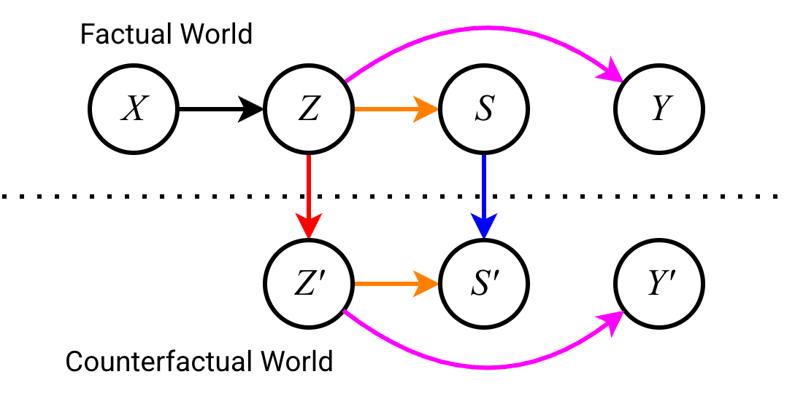
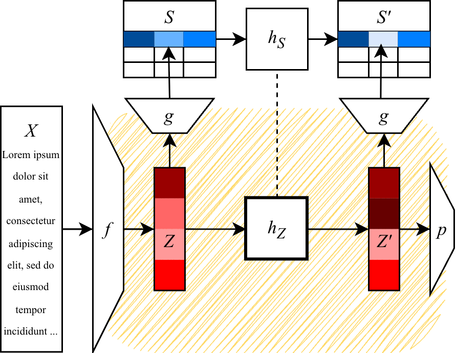

<!-- Template: https://github.com/mpimet/quarto/blob/main/poster.qmd -->

<!-- # Abstract { .col3 .row2 }

Counterfactual fairness, i.e., asking how a prediction would change under interventions on sensitive attributes, is hard to operationalize for unstructured inputs such as text. We propose a modular neurosymbolic framework that decouples representation learning from causal intervention: a pretrained encoder maps text to a latent representation, a semantic decoder grounds part of this space in a structured causal subgraph, and a neural manipulator learns to transform the latent representation analogously to a symbolic counterfactual operation on the decoded features, trained under a consistency constraint between the two. The approach localizes causal assumptions in an explicit subgraph, trading end-to-end optimization for auditability. -->

# Motivation { .col3 .row1 }
- Sensitive attributes influence screening and hiring decisions.
- Algorithmic hiring systems offers an opportunity to reduce human stereotyping and discrimination
- **BUT**: they inherit societal biases from their training data.

## Question: Counterfactual Fairness
- ,,How would a person's CV look like if its sensitive attribute(s) were different? Would this person be treated differently?''
- Requires causal reasoning to generate this person's data in a counterfactual world
- Non-trivial, particularly with unstructured high-dimensional data, such as text

## Contribution 
Methodology to generate a counterfactual latent representation of a text input

- **Modular**: Pre-trained VAE to map text to a latent representation + neurosymbolic manipulator (NSM) model to transform these representations
- **Causal-aware**: NSM learns a latent transformation analogously to a causal intervention (abduction-action-prediction) on observable data w.r.t. a sensitive attribute.


# Problem Formulation { .col3 .row2 }
{ width=65% }

## Known:
- $X$ - text input (e.g., a CV)
- $A$ - sensitive attribute (e.g., gender)
- $Z$ - latent representation produced by a pre-trained encoder $Z = f(X)$

## Goal:
- $Z'$ - counterfactual latent representation of $X$ w.r.t. $A$
- $\rightarrow$ e.g., a CV-representation of the same person if their gender were different

## Auxiliary information:
- $S$ - set of bias-relevant observable tabular features (descendants of $A$ in the causal graph, e.g., number of programming languages, years of experience, etc.)
- $M$ - structural causal model over $S$ that captures the causal effect of $A$ on a task.


# Procedure { .col3 .row3 .note }

## 0. Pre-trained encoder $f: X \rightarrow Z$

## 1. Semantic Decoder $g: Z \rightarrow S$
- Partial mapping from the latent space to a structured representation of bias-relevant features.
- Trained on synthetic data with matching $X$ and $S$ 
- Consistency signal for step 2

## 2. Neurosymbolic Manipulator $h$
- Symbolic operation: $h_S: S \rightarrow S'$ calculates the counterfactual $S'$ to $S$ w.r.t. $A$ via abduction-action-prediction on $M$.
- Neural manipulator: $h_Z: Z \rightarrow Z$ learns the transformed latent representation $Z' := h_Z(Z)$ analogously to $h_S(S)$, trained under a consistency constraint.
\begin{equation}
  h_S(g(Z)) = g(h_Z(Z))
\end{equation}
- Training objective:
\begin{equation}
  \mathcal{L} = \underbrace{d_S(h_S(g(Z)), g(h_Z(Z)))}_{\text{Consistency Constraint}} + \underbrace{ \alpha \cdot ||h_Z(Z) - Z||_1}_{L_1\text{: Sparsity Penalty}} + \underbrace{\beta \cdot ||h_Z(Z) - Z||_2^2}_{L_2 \text{: Deviation Penalty}}
\end{equation}


## 3. Downstream Task
- Use $Z$ and $Z'$ for downstream tasks, e.g., bias mitigation by penalizing a predictor $p$ if $p(Z) \neq p(Z')$.

# { .col3 .row2}


<!-- # Background and Related Work { .col2 .row2}
% Counterfactual fairness
\paragraph{Counterfactual Fairness}
Counterfactual fairness \cite{kusner2017counterfactual} requires that a prediction remains stable under interventions on sensitive attributes, e.g., the predicted job fitness should not change if an applicant had a different gender. Generating such counterfactuals requires a causal model of the data to estimate the effect of an intervention. Path-specific counterfactual fairness \cite{chiappa_path-specific_2019} relaxes this by intervening only on selected pathways.

% Representation Learning and Fairness
\paragraph{Fair representation learning}
Following \textit{Learned Fair Representations} \citep{zemel_learning_2013}, the fairness research community has turned its gaze onto representation learning. Many approaches have thus been developed to implement a constrained encoding of data to a lower dimensional representation via
adversarial learning \citep[e.g.,][]{madras_learning_2018}, dimensionality reduction \citep{kamani_efficient_2022, perez_fair_2017} or with variational autoencoders \citep[e.g.,][]{creager_flexibly_2019, louizos_variational_2016, oh_learning_2022}. %, liu_fair_2023, , rateike_dont_2022}.
A recent approach leveraged VAEs to create latent representations of text with an independence constraint \cite{ng2025debiasing}. Similarly to other literature, they train an encoder to directly map an input $X$ to a debiased representation $Z^*$. Closer to ours, \citet{creager_flexibly_2019, oh_learning_2022} also adopt a modular design that separates encoding from debiasing.

% Causal-Aware ML
\paragraph{Deep counterfactual inference}
Deep Structural Causal Models \cite{pawlowski_dscm_2020} operationalize Pearl's abduction-action-prediction procedure using normalizing flows and VAEs as (pseudo-)invertible connectors, with extensions to high-resolution images \cite{sousaribeiro_fidelty_2023} and graph-structured data \cite{sanchezmartin_vaca_2022}, the latter applied to a counterfactual fairness setting. Unlike these works, we do not use the VAE as a functional connector within an SCM but only to encode data into a low-dimensional space, where a learned manipulator approximates the intervention.

% Our work is similar to this line of research, as we also use VAEs in combination with SCMs to create counterfactuals of high-dimensional data. However, we do not employ them as functional connectors within an SCM, but just to encode the data to a low-dimensional state, which can be transformed by a latent function approximating an SCM.

% Neurosymbolic Approach
\paragraph{Neurosymbolic latent reasoning}
The idea for this work stems from a neurosymbolic planning approach called \textit{LatPlan} \cite{asai2022classical}, which divides the solution of image puzzles in two steps: neural encoding of the image to a discrete latent representation and symbolic latent space reasoning. We adopt this modular approach, although we do not enforce discrete latents, but train a continuous latent manipulator approximating a symbolic procedure, i.e. calculating a counterfactual.

Our contribution sits at the intersection of these threads: a modular, neurosymbolic architecture that approximates counterfactual interventions in the latent space of VAE. -->


# Data & Experiments { .col3 .row4 }
Both the decoder training and the manipulator's empirical evaluation are ongoing. We will conduct experiments on a synthetic and a real world dataset.

## Synthetic Data
The reasons to create a synthetic dataset are twofold: a dataset with matching $X$ and $S$ is needed to train the semantic decoder described in phase 1 of Section~\ref{sec:proc}. Also, we want to create controlled conditions to test our hypothesis that a manipulator model is trainable as a latent analogy to a symbolic operation on structured data.
We first construct an SCM modeling some causal paths originating from $A$ and involving $S$ as a set of descendants. We then use it to sample a structured tabular dataset. Finally, we use an LLM to create a text instance (i.e., a CV) from each simulated observation to obtain $X$.

## Real World Data
To test the applicability of the framework, we implement it with the \textit{Bias in Bios} CV dataset \cite{arteaga_biasbios_2019}, where gender is the sensitive attribute and profession is the target. There are two major challenges regarding this transfer to the real world: first, we need to make strong assumptions about causal relationships involving the sensitive attribute we are targeting to construct an SCM on $S$. Furthermore, we do not know $S$, but need to estimate it using a pre-trained semantic decoder.

# Discussion { .col3 .row3 }
<!-- We propose a modular framework that separates representation learning from causal intervention: a pretrained text encoder produces a latent representation, and a neural manipulator transforms it analogously to a symbolic counterfactual operation on a structured decoding. This decomposition trades end-to-end debiasing for a more auditable inference pipeline, in which the causal assumptions live in an explicit, inspectable subgraph rather than implicitly inside an encoder. -->

- Framework inherits assumptions from SCMs: no hidden confounders and full observability of $S$
- **Central open question**: Does the latent manipulator learn a faithful analogue of the symbolic operation in practice
- **If yes**: decomposition delivers on the flexibility and auditability that motivated the design.


<!-- # Extra Scholary Information { .col3 }

In scholary writing, it's common to provide a whole bunch of extra header information (e.g. affiliations, keywords, license, citation etc...). Please have a look at [Quarto's Authoring documentation](https://quarto.org/docs/authoring/front-matter.html) to see what's possible. Currently the poster template supports affiliations, but more may come...

# How to work with the grid { .col2 .row2 }
You can use the six columns for a 2 or 3 column layout or
combine both, dividing your poster into several sections. If
your content allows it you can also use the 6 columns more
freely – it’s just a help to align your content more easily.

In order to make a section multi-column, you'll have to add a CSS class to the section header, e.g.:

```markdown
# 3-column section { .col3 }
```

The same works with any `.colX`-value from `1` to `6`.

Similarly, you can add `.rowY` classes if a section should span multiple rows. 

# Generating the poster { .col2 }

You can generate the poster (as HTML) using the folling command:

```bash
quarto render your-file.qmd
```

# Hints { .col3 .note }
* **Order – create an overview**
* Group and organise content - we can grasp ordered content more quickly
* Reuse key design elements. The viewer recognises elements that are repeated and belong together.
* **Contrast – build tension**
* Use contrast to draw the viewer‘s attention to things, e.g. size, brightness, color. Contrast can set accents in design.
* **Reduction – create more with less**
* Reduce to the essentials: emphasise what is important and check every element for its justification -> don‘t be afraid of free spaces.

# More Information { .col3 }

You can learn more about getting started with Quarto here: <https://quarto.org/docs/get-started/>

# Nested Headings { .col2 }

Nested headings are possible and don't create new boxees...

## Subheading 1
Test

## Subheading 2
Test-->
