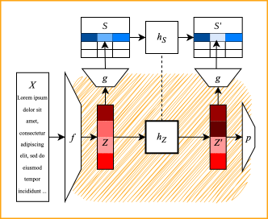
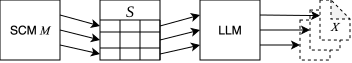
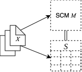
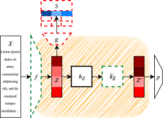

<!-- Template: https://github.com/mpimet/quarto/blob/main/poster.qmd -->

<!-- # Abstract { .col3 .row2 }

Counterfactual fairness, i.e., asking how a prediction would change under interventions on sensitive attributes, is hard to operationalize for unstructured inputs such as text. We propose a modular neurosymbolic framework that decouples representation learning from causal intervention: a pretrained encoder maps text to a latent representation, a semantic decoder grounds part of this space in a structured causal subgraph, and a neural manipulator learns to transform the latent representation analogously to a symbolic counterfactual operation on the decoded features, trained under a consistency constraint between the two. The approach localizes causal assumptions in an explicit subgraph, trading end-to-end optimization for auditability. -->

# Motivation { .col3 .row1 }
- Sensitive attributes influence screening and hiring decisions.
- Algorithmic hiring systems offer opportunity to reduce stereotyping and discrimination
- **BUT**: they inherit societal biases from their training data.

## Question: Counterfactual Fairness
- ,,**How would a person's CV look like if its sensitive attribute(s) were different?**''
- ,,**Would this person be treated differently?**''
- Requires causal reasoning to generate this person's data in a counterfactual world
- Non-trivial, particularly with **unstructured high-dimensional data**, such as text

## Contribution 
Methodology to generate a counterfactual latent representation of a text input

- **Modular**: Pre-trained VAE to map text to a latent representation + neurosymbolic manipulator model to transform these representations
- **Causal-aware**: Manipulator learns a latent transformation analogously to a causal intervention (abduction-action-prediction) on observable data w.r.t. a sensitive attribute.


# Problem Formulation { .col3 .row1 }

::: {.columns}
::: {.column width="35%"}
## Known:
- $X$ - text input (e.g., a CV)
- $A$ - sensitive attribute (e.g., gender)
- $Z$ - latent representation produced by a pre-trained encoder $Z = f(X)$

## Goal:
:::

::: {.column width="65%"}
{ width=90% fig-align="left" }
:::
:::
- $Z'$ - counterfactual latent representation of $X$ w.r.t. $A$
- $\rightarrow$ e.g., a CV-representation of the same person if their gender were different

## Auxiliary information:
- $S$ - set of bias-relevant observable tabular features (descendants of $A$ in the causal graph, e.g., number of programming languages, years of experience, etc.)
- $M$ - structural causal model over $S$ that captures the causal effect of $A$ on a task.


# Procedure { .col6 .row2 .note }
::: {.columns}
::: {.column width="47%"}

:::
::: {.column width="3%"}
:::
::: {.column width="50%"}

<!-- # Procedure { .col3 .row2 .note } -->

## 0. Pre-trained encoder $f: X \rightarrow Z$

## 1. Semantic Decoder $g: Z \rightarrow S$
- Partial mapping from latent space to structured representation $S$
- Trained on synthetic data with matching $X$ and $S$ 
- Consistency signal for step 2

## 2. Neurosymbolic Manipulator $h_{S/Z}$
- Symbolic operation: $h_S: S \rightarrow S'$ calculates the counterfactual $S'$ to $S$ w.r.t. $A$ via abduction-action-prediction on $M$
- Neural manipulator: $h_Z: Z \rightarrow Z$ learns the transformed latent representation $Z' := h_Z(Z)$ analogously to $h_S(S)$
<!-- - Trained under a consistency constraint: -->
\begin{equation}
  h_S(g(Z)) = g(h_Z(Z))
\end{equation}
- Training objective ($d_S$ is a distance function in $S$-space):
\begin{equation}
  \mathcal{L} = \underbrace{d_S(h_S(g(Z)), g(h_Z(Z)))}_{\text{Consistency Constraint}} + \underbrace{ \alpha \cdot ||h_Z(Z) - Z||_1}_{L_1\text{: Sparsity Penalty}} + \underbrace{\beta \cdot ||h_Z(Z) - Z||_2^2}_{L_2 \text{: Deviation Penalty}}
\end{equation}


## 3. Downstream Task
- E.g., a predictor $p$ with constraint $p(Z) \neq p(Z')$

:::
:::

# Data & Hypotheses { .col3 .row2 }

## Synthetic Data
::: {.columns}
::: {.column width=30%}
* Approach simliar to @toker_liberty_2026
* Dataset with matching $X$ and $S$ to train the semantic decoder $g$
:::

::: {.column width=70%}
{width=100% fig-alt="1. SCM $M$ models some causal paths from $A$ and involving $S$ as descendants. 2. Tabular data $S$ is sampled from $M$. 3. LLM generates $X$ from each instance of $S$."}
:::

:::


<!-- ::: {.columns}
::: {.column width=48%}
  1. SCM $M$ modeling some causal paths from $A$ and involving $S$ as descendants
  2. Sample tabular data $S$ from $M$
  3. Use LLM to generate $X$ from $S$.
:::
::: {.column width=4%}
:::
::: {.column width=48%}
  <br>
  
:::
::: -->

* **Challenges**:
  * LLM may introduce additional hidden confounders descending from $A$
  * External validty


::: {.columns}
::: {.column width=60%}
## Real World Data
* CV dataset, e.g., *Bias in Bios* [@arteaga_biasbios_2019]
* **Challenges**:
  * SCM requires strong causal assumptions
  * Tabular representation $S$ is unknown
:::
::: {.column width=30%}
{fig-alt="1. An SCM is constructed fo an existing CV dataset. 2. The dataset is annotated with a tabular entry in $S$ for each CV."}
:::

:::


## Hypotheses { .col3 .row1 }
1. **Analogy**: $h_Z$ can be trained to generate the counterfactual of $Z$ analoguously to $h_S$
2. **Sparsity**: $h_Z$ only adjusts observed confounders
3. **Effectiveness**: $Z'$ and $Z$ can be used to debias a prediction model
4. **Meaningfulness**: There exists a decoder that can retrieve the counterfactual $X'$ to $X$ from $Z'$


# Related Work { .col3 .row1 }
* **(Path-specific) counterfactual fairness** [@chiappa_path-specific_2019; @kusner2017counterfactual]: fairness through interventions on specified causal paths in an SCM.
* **Fair representation learning** [@zemel_learning_2013; @creager_flexibly_2019; @oh_learning_2022]: learning a latent representation that is invariant to sensitive attributes.
* **Deep Structural Causal Models** [@pawlowski_dscm_2020]: SCMs with VAEs as functional connectors, trained end-to-end on observational data.
* **Neurosymbolic latent reasoning** [@asai2022classical]: dividing a complex task into a neural ,,perception" encoder and a latent symbolic reasoning module.

<!-- $\rightarrow$ Our contribution sits at the **intersection** of these threads. -->
<!-- a modular, neurosymbolic architecture that approximates counterfactual interventions in the latent space of a VAE. -->

 
# Discussion { .col3 .row1 }
::: {.columns}
::: {.column width=55%}
## Advantage: Modularity
- Flexibile, auditable and composable
- Independence from encoder training

## Limitations: SCM Assumptions
- No hidden confounders $\rightarrow$ $M$ is accurate
- Full observability of $S$ $\rightarrow$ $g$ is well-fit

## Scope
- Value beyond fairness, e.g., privacy or safety<br>
$\rightarrow$ **Latent Symbolic Interventions**
:::

::: {.column width=45%}

:::
:::

- **Central open question**:<br>Can a latent manipulator learn a faithful analogue of the symbolic operation in practice?

::: {.poster-footer}
[leo.kestel@lmu.de](mailto:leo.kestel@lmu.de) · [leokestel.de](https://leokestel.de)
:::

<!-- # Extra Scholary Information { .col3 }

In scholary writing, it's common to provide a whole bunch of extra header information (e.g. affiliations, keywords, license, citation etc...). Please have a look at [Quarto's Authoring documentation](https://quarto.org/docs/authoring/front-matter.html) to see what's possible. Currently the poster template supports affiliations, but more may come...

# How to work with the grid { .col2 .row2 }
You can use the six columns for a 2 or 3 column layout or
combine both, dividing your poster into several sections. If
your content allows it you can also use the 6 columns more
freely – it’s just a help to align your content more easily.

In order to make a section multi-column, you'll have to add a CSS class to the section header, e.g.:

```markdown
# 3-column section { .col3 }
```

The same works with any `.colX`-value from `1` to `6`.

Similarly, you can add `.rowY` classes if a section should span multiple rows. 

# Generating the poster { .col2 }

You can generate the poster (as HTML) using the folling command:

```bash
quarto render your-file.qmd
```

# Hints { .col3 .note }
* **Order – create an overview**
* Group and organise content - we can grasp ordered content more quickly
* Reuse key design elements. The viewer recognises elements that are repeated and belong together.
* **Contrast – build tension**
* Use contrast to draw the viewer‘s attention to things, e.g. size, brightness, color. Contrast can set accents in design.
* **Reduction – create more with less**
* Reduce to the essentials: emphasise what is important and check every element for its justification -> don‘t be afraid of free spaces.

# More Information { .col3 }

You can learn more about getting started with Quarto here: <https://quarto.org/docs/get-started/>

# Nested Headings { .col2 }

Nested headings are possible and don't create new boxees...

## Subheading 1
Test

## Subheading 2
Test-->
