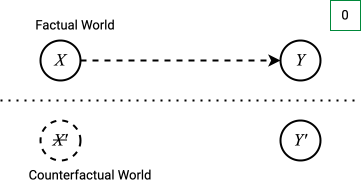
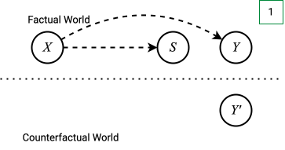
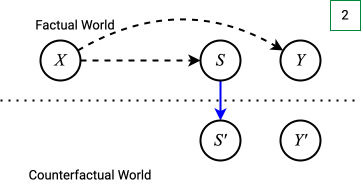
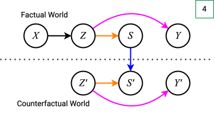
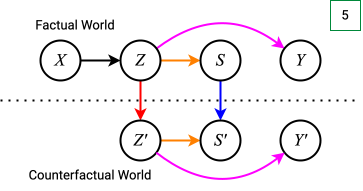

## The Problem: Counterfactual Fairness with Text Data

An example:

::: {.incremental}
- Sensitive attributes influence screening and hiring decisions.
- Algorithmic hiring systems offer opportunity to reduce stereotyping and discrimination
- **BUT**: they inherit societal biases from their training data.
:::

::: {.fragment}
,,**How would a person's CV look like if its sensitive attribute(s) were different?**''
:::

## What We Need: Causal Knowledge

::: {.r-stack}

::: {.fragment fragment-index=1}
{width="500"}
:::
::: {.fragment fragment-index=2}
{width="500"}
:::
::: {.fragment fragment-index=3}
{width="500"}
:::
::: {.fragment fragment-index=4}
{width="500"}
:::
::: {.fragment fragment-index=5}
{width="500"}
:::
::: {.fragment fragment-index=6}
{width="500"}
:::

:::

::: {.columns}
::: {.column width="45%"}

::: {.fragment  fragment-index=1}
### Known:
$X$ - text input (e.g., a CV)
:::
::: {.fragment  fragment-index=2}
$S$ - struct. features (e.g., extracted from CV)
:::
::: {.fragment  fragment-index=3}
$h_S$ - counterfactual function in $S$ space (**causal knowledge**)
:::
::: {.fragment  fragment-index=4}
$Z = f(X)$ - latent representation produced by a pre-trained encoder
:::
:::

::: {.column width="10%"}
:::

::: {.column width="45%"}

::: {.fragment  fragment-index=6}
### Goal:
$Z' = h_Z(Z)$ - counterfactual latent representation of $X$ <br>(e.g., a CV-representation of the same person if their gender were different)
:::

:::
:::

## The Idea: Modular Causally Aware Interventions


::: {.notes}
- modular causally aware interventions in text classification
:::

## Visit my poster to discuss...

::: {.columns}
::: {.column}
* $h_Z$ as a single-layer transformer vs. normalizing flow
* counterfactual point-estimates vs. distributions
* practicability of causal assumptions
* applications beyond counterfactual fairness
:::

::: {.column}
```{r}
library(qrcode)

plot(qr_code("https://leokestel.de/latent_intervention"))
```
[leokestel.de/latent_intervention](https://leokestel.de/latent_intervention)

:::
:::

<!-- You can add a polaroid effect to embedded images:

```markdown
{.polaroid}
```

::::{.columns}
:::{.column}
{height=300px}
:::

:::{.column}
{height=300px .polaroid}
:::
::::

## Colors

* You can use pre-defined colors that adhere to the MPI-M design guidelines
* To apply a color, add the relevant CSS class:
  ```markdown
  This is a sentence with [colored words]{.green} in between.
  ```
* The available colors are [**darkgreen**]{.darkgreen}, [**green**]{.green}, [**lightgreen**]{.lightgreen}, and [**orange**]{.orange}

## Transition slides

You can insert a transition slide by adding the `{.separator}` class to the heading:

```markdown
# New chapter {.separator}
```

In addition, there are twelve numbered section separators available:

```markdown
# Chapter 01 {.separator-01}
```

_see next slides_

# New chapter {.separator}

# Chapter 01 {.separator-01}

## More Information

You can learn more about controlling the appearance of RevealJS output here: <https://quarto.org/docs/presentations/revealjs/> -->
